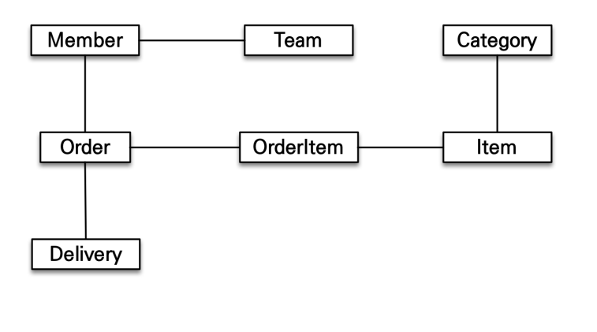
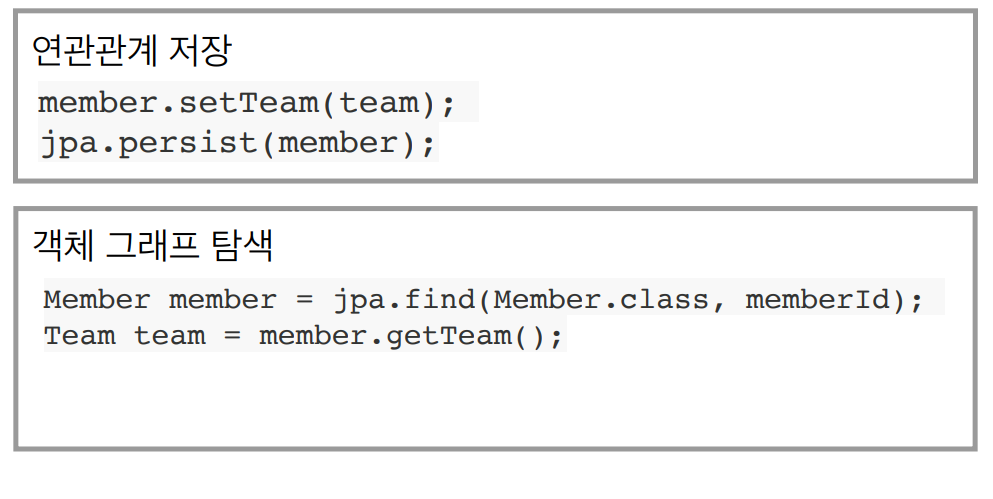
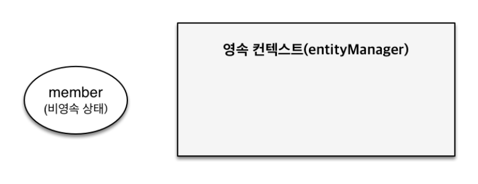
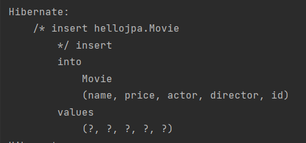
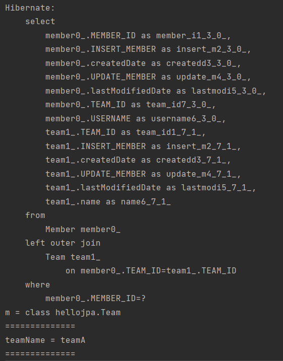
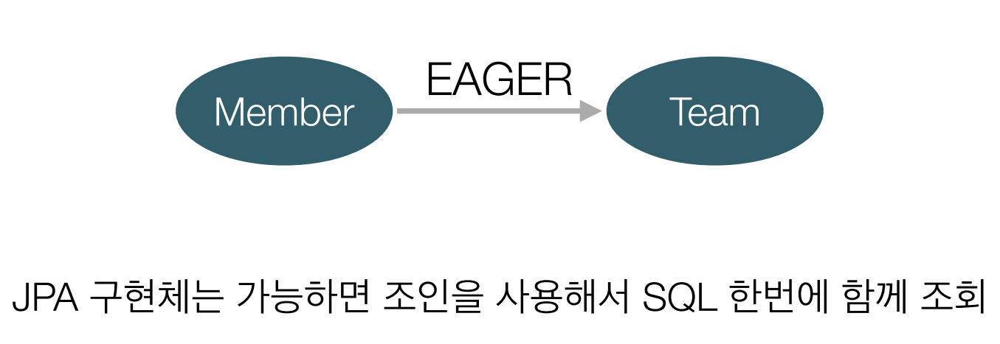
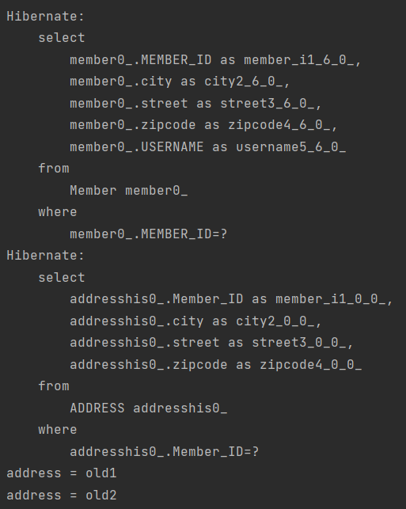

# JPA

- JPA (Java Persistence API)

## 목표 - 객체와 테이블 설계 매핑

- 객체와 테이블을 제대로 설계하고 매핑하는 방법
- 기본 키와 외래 키 매핑
- 1:N, N:1, 1:1, N:M 매핑
- 실무 노하우 + 성능까지 고려
- 어떠한 복잡한 시스템도  JPA로 설계 가능

## 목표 - JPA 내부 동작 방식 이해

- JPA의 내부 동작 방식을 이해하지 못하고 사용
- JPA 내부 동작 방식을 그림과 코드로 자세히 설명
- JPA가 어떤 SQL을 만들어 내는지 이해
- JPA가 언제 SQL을 실행하는지 이해

# JPA와 모던 자바 데이터 저장 기술

- SQL 중심적인 개발의 문제점
- JPA 소개

## SQL 중심적인 개발의 문제점

- 무한 반복, 지루한 코드 (CRUD)
- 객체의 필드 추가시 객체에 관련된 쿼리문을 전부 수정해야함.

### **객체를 관계형 데이터베이스에 저장**

---

객체 → SQL 변환 → RDB에 접근

객체와 관계형 데이터베이스는 같은 구조가 아니므로 개발자가 객체를 관계형 데이터베이스에 저장 또는 조회를 하기 위해 SQL 매퍼를 작성해줘야함.

### **객체와 관계형 데이터베이스의 차이**

---

1. 상속
2. 연관관계
3. 데이터 타입
4. 데이터 식별 방법

**상속**


- 기본적으로 관계형 데이터베이스에는 상속이란 개념이 없다.
- 관계형 데이터베이스에서는 상속 대신 슈퍼타입 서브타입 관계라는 개념이 존재함

**연관관계**

- 객체는 참조를 사용: member.getTeam()
- 테이블은 외래 키를 사용: JOIN ON M.TEAM_ID = T.TEAM_ID


*객체를 테이블에 맞추어 모델링*

---


*테이블에 맞춘 객체 저장*

---


- 관계형 데이터베이스에 저장할때 바로 `Member` 객체가 가지고 있는 필드를 가져와서 인자로 넣어주면 된다.
- 하지만 `Member` 객체와 `Team` 객체의 연관관계가 객체다운 형태는 아니다.

*객체다운 모델링*

---


*객체 모델링 저장*

---


- `Member` 객체에서 `Team` 객체를 꺼내고 또 `team_id`를 가져 와야 하는 번잡함이 있다.

*객체 모델링 조회*

---


- 데이터베이스의 성능을 위해 `Member`와 `Team` 객체를 한번에 조회를 하게된다. 조회쿼리 실행 후 `Member` 객체의 정보를 `set()` 해주고 또 `Team` 객체의 정보를 `set()` 해주고 그리고 `Member` 객체에 `Team` 객체를 `set()` 해줘야하는 번거로움이 발생한다.

*객체 모델링, 자바 컬렉션에 관리*


- 만약 이렇게 객체를 관계형 데이터베이스가 아닌 자바 컬렌션에 저장을 할 수 있다 가정하면 코드 한줄로 객체를 저장하고 조회가 가능하다.

**※ 객체와 관계형 데이터베이스의 연관관계를 바라보는 방법이 다르기 때문에 복잡한 변환과정이 필요하게 된다.**

*객체 그래프 탐색*

---

객체는 자유롭게 객체 그래프를 탐색할 수 있어야 한다.



- Member.getTeam(), Member.getOrder(), Order.getDelivery() 등등.. 객체에서 객체로 다 따라갈 수 있어야 한다.

*처음 실행하는 SQL에 따라 탐색범위 결정*

---


- 조회 쿼리 작성시 `Member`와 `Team` 객체만 조회를 하게되면 `Member` 객체에 `Order` 객체는 존재하지 않게 된다.

*엔티티 신뢰 문제*

---


- 내가 아닌 누군가 `memberDAO.find(id)`메서드를 짰을때 어떻게 짰는지 확인 해 봐야만 `member.getTeam()`, `member.getOrder().getDelivery()` 메서드를 호출할 수 있다.

*모든 객체를 미리 로딩할 수는 없다.*

---


**※ 진정한 의미의 계층 분할이 어렵다.**

**물리적으로는 분할이 되어있으나 논리적으로는 엮여있다.**

*비교하기*

---


- `memberDAO.getMember(id)`를 실행시 보통 새로운 객체를 만들어 반환하기 때문에 같은 id로 조회를 한다고 해도 데이터는 같아도 인스턴스는 다르게 된다.

*비교하기 - 자바 컬렉션으로 조회*

---


- **객체가 컬렉션에 저장되어있다고 가정하고 컬렉션에서 객체를 같은 id로 조회시 데이터도 같고 객체도 같게 된다.**
- **객체답게 모델링 할수록 매핑 작업만 늘어난다.**

> **객체를 자바 컬렉션으로 저장 하듯이 DB에 저장할 수는 없을까?
이런 고민이 계속 있었고 그 문제를 해결하는게 바로 JPA이다.**
>

# JPA 소개

## JPA?

- Java Persistence API
- 자바 진영의 ORM 기술 표준

## ORM?

- Object-relational mapping(객체 관계 매핑)
- 객체는 객체대로 설계
- 관계형 데이터베이스는 관계형 데이터베이스대로 설계
- ORM 프레임워크가 중간에서 매핑
- 대중적인 언어에는 대부분 ORM 기술이 존재

## JPA는 애플리케이션과 JDBC 사이에서 동작


- JAVA 애플리케이션에서 DB에 접근하려면 JDBC API를 통해서 접근해야하는데 기존에는 개발자가 직접 JDBC API를 썼다면 JPA가 대신 해준다고 생각하면 된다.

## JPA 동작 - 저장


- MemberDAO에서 JPA에 Member 객체를 저장하는 명령어를 내리면 JPA가 해당 Member 객체를 분석해서 INSERT SQL을 생성하고 JDBC API를 사용하여 DB에 INSERT SQL을 실행한다.
- 객체와 관계형 데이터베이스의 패러다임을 해결

## JPA 동작 - 조회


- MemberDAO에서 JPA에 Member 객체를 조회하는 명령어를 내리면 JPA가 SELECT SQL을 생성하고 JDBC API를 사용하여 DB에 SELECT SQL을 실행하여 결과를 받으면 Member 객체에 맞게 ResultSet 매핑까지 다 해서 Member 객체를 반환해준다.
- 객체와 관계형 데이터베이스의 패러다임을 해결

## JPA왜 사용해야 하는가?

- SQL 중심적인 개발에서 객체 중심으로 개발
- 생산성
- 유지보수
- 패러다임의 불일치 해결
- 성능
- 데이터 접근 추상화와 벤더 독립성
- 표준

### 생산성 - JPA와 CRUD

- 저장: jpa.persist(member)
- 조회: Member member = jpa.find(memberId)
- 수정: member.setName(”변경할 이름”)
- 삭제: jpa.remove(member)

### 유지보수

**기존: 필드 변경시 모든 SQL 수정**


**JPA: 필드만 추가하면 됨, SQL은 JPA가 처리**

---


### JPA와 패러다임의 불일치 해결

1. JPA와 상속
2. JPA와 연관관계
3. JPA와 객체 그래프 탐색
4. JPA와 비교하기

**JPA와 상속**

---


*저장*

---


- 기존의 방식이라면 Album 객체를 저장하려면 개발자가 직접 Item 데이터를 Insert하고 Album 데이터를 Insert해야하는데 `jpa.persist(album);`이라는 명령어만 사용하면 JPA가 알아서 처리를 해준다.

*조회*

---


- Album 객체를 조회하려면 Item 테이블도 Join하여 Item 객체도 조회해야 하는데 `jpa.find(Album.class, albumId);`명령어로 JPA가 Select 쿼리를 생성해서 알아서 조회까지 해준다.

**JPA와 연관관계, 객체 그래프 탐색**

---



- Member 객체에 Team 객체를 set해주고 `jpa.persist(member);`명령어를 실행해주면 Member 객체와 Team 객체가 DB에 Insert된다.
- Member 객체를 저장하고 `jpa.find(Member.class, memberId);`명령어로 Member 객체를 조회하면 Member 객체에 Team 객체가 set() 되어있는 Member 객체가 반환이 된다.

**신뢰할 수 있는 엔티티, 계층**

---


- JPA를 통해 Member 객체를 조회하면 DB에 데이터가 있다는 존재하에 Member 객체의 연관관계에 의해서 `member.getTeam()`, `member.getOrder().getDelivery()`코드를 사용해 객체를 다 꺼낼 수 있다.
- 지연로딩을 사용

> 참고: JPA가 관리하는 객체를 엔티티라고 함
>

**JPA와 비교하기**

---


- jpa를 통해 데이터를 가져왔을때 같은 데이터를 조회하게 되면 두 객체는 동일한 객체이다.
    - 단 같은 트랜잭션에서 조회한 객체만 보장해줌.

**JPA의 성능 최적화 기능**

---

1. 1차 캐시와 동일성(identity)보장
2. 트랜잭션을 지원하는 쓰기 지연(transactional write-behind)
3. 지연 로딩(Lazy Loading)

*1차 캐시와 동일성 보장*

---

1. 같은 트랜잭션 안에서는 같은 엔티티를 반환 - 약간의 조회 성능 향상
2. DB Isolation Level이 Read Commit이어도 애플리케이션에서 Repeatable Read 보장


1. `jpa.find(Member.class, memberId);`가 처음 실행 될 때는 SQL을 실행하여 데이터를 가져온 후 메모리에 해당 객체를 올려놓는다.
2. 같은 트랜잭션 상에서 이전에 실행한 memberId로 `jpa.find(Member.class, memberId);`메소드가 호출 시 JPA가 SQL을 실행하지 않고 메모리에 올려놓은 객체를 반환하게 되면서 SQL을 1번만 실행하게 된다.

**DB의 트랜잭션 격리 수준 (Isolation Level)**

- **READ UNCOMMITED**
- **READ COMMITED**
- **REPEATABLE READ**
- **SERIALIZABLE**

*READ UNCOMMITED*

---

READ UNCOMMITED 격리 수준에서 트랜잭션 간의 데이터 변경 내용이 COMMIT이나 ROLLBACK에 상관없이 공유가 된다.

1. 트랜잭션 A가 물품의 가격을 10,000원 → 5,000원 으로 변경
2. 트랜잭션 A가 아직 커밋되지 않음
3. 트랜잭션 B에서 해당 물품을 조회시 가격이 5,000원으로 조회됨
   1. 이를 더티 리드 (dirty read)라고 한다.
4. 트랜잭션 A에서 문제가 생겨 ROLLBACK이 됨
5. 트랜잭션 B에서는 그대로 5,000원으로 프로세스가 진행됨

**※ READ UNCOMMITED는 이렇게 데이터의 정합성에 문제가 많아 RDBS 표준에서는 트랜잭션 격리수준으로 인정되지 않는다.**

*READ COMMITED*

---

READ COMMITED 격리 수준에서는 트랜잭션 간의 데이터 변경 내용이 COMMIT이 되었을 때만 공유가 된다. → 오라클 DB에서 사용하는 격리 수준이다.

1. 트랜잭션 B가 물품을 조회함 → 물품 가격 10,000원
2. 트랜잭션 A가 물품의 가격을 10,000원 → 5,000원으로 변경
3. 트랜잭션 A가 커밋함
4. 트랜잭션 B에서 물품을 다시 조회하면 10,000원이 아닌 5,000원으로 조회

**※ READ COMMITED는 한 트랜잭션 내에세 같은 데이터를 조회했을 때 데이터는 항상 같아야 한다는 REPEATABLE READ의 정합성에 부합한다.**

*REPEATABLE READ*

---

REPEATABLE READ 격리 수준에서는 트랜잭션이 시작되기 전에 커밋된 내용만 조회할 수 있다.
→ MySQL에서 사용하는 격리 수준이다.
(모든 InnoDB의 트랜잭션은 고유한 트랜잭션 번호(순차적으로 증가)를 가지고 있으며, UNDO 영역에 백업된 모든 레코드는 변경을 발생시킨 트랜잭션의 번호를 가지고 있다.)

1. 트랜잭션 B가 물품을 조회함 → 물품 가격 10,000원
2. 트랜잭션 A가 물품의 가격을 10,000원 → 5,000원으로 변경
3. 트랜잭션 A가 물품의 가격을 변경하면서 실제 DB에 존재하는 데이터를 UPDATE해주고 기존의 데이터는 UNDO 영역에 백업함
4. 트랜잭션 B에서 다시 물품을 조회해도 데이터는 UNDO 영역에 있는 데이터를 조회하기 때문에 REPEATABLE READ 정합성의 어긋나지 않게 된다.
   1. 하지만 UPDATE 부정합이 발생하게 된다.
5. 트랜잭션 B에서 물품의 가격을 10,000원 → 12,000원으로 변경 시도
6. **트랜잭션 B에서 물품의 가격을 변경하기 위해 물품 데이터에 쓰기 잠금(LOCK)을 하려고 실제 DB 테이블에서 데이터를 찾는다. 하지만 해당 물품 데이터는 UNDO 영역에 존재하는 데이터라 찾을 수가 없어 변경된 건 없이 트랜잭션이 끝나고 만다.**
   1. **→ 해당 방식으로 인한 Phontom READ가 발생할 수 있다.**

**※ REPEATABLE READ는 REPEATABLE READ의 정합성은 만족하지만, UPDATE 정합성은 만족하지 못한다.**

**JPA에선 DB의 UNDO 영역을 영속성 컨텍스트의 1차 캐시로 사용해 어플리케이션 자체에서 REPEATABLE READ의 트랜잭션 격리 수준을 보장해주게 된다.**

*SERIALIZABLE*

---

SERIALIZABLE은 가장 단순하고 가장 엄격한 격리 수준이다.
InnoDB에서는 기본적인 SELECT 쿼리에 잠금을 걸지 않고 실행하는데, 격리수준이 SERIALIZABLE일 경우엔 읽기 작업에도 `공유 잠금`을 설정하고 다른 트랜잭션에서 `공유 잠금`이 설정되어 있는 데이터에 대해 변경이 불가능하게 된다.

**※ SERIALIZABLE의 특성 때문에 다른 격리 수준에 비해 동시 처리 능력이 떨어져 성능 저하가 발생한다.**

*트랜잭션을 지원하는 쓰기 지연 - INSERT*

---

1. 트랜잭션을 커밋하기 전까지 버퍼 메모리에 INSERT SQL을 모음
2. JDBC BATCH SQL 기능을 사용하여 트랜잭션을 커밋하기 전에 INSERT SQL을 한번에 전송


*지연 로딩과 즉시 로딩*

---

- 지연 로딩: 객체가 실제 사용될 때 로딩
- 즉시 로딩: JOIN SQL로 한번에 연관된 객체까지 미리 조


- Member 객체를 사용하면서 Team 객체를 자주 사용안하면 지연 로딩으로 설정을 해줄 수 있게 제공하여 최적화를 가능하게 해준다.

# JPA 시작

- Hello JPA - 프로젝트 생성
- Hello JPA - 애플리케이션 개발

## Hello JPA - 프로젝트 생성

- java 8 이상 (8 권장)
  - 11 사용
- 메이븐 설정
  - groupId : jpa-basic
  - artifactId : ex1-hello-jpa
  - version : 1.0.0

*Maven Project 생성*


**라이브러리 추가 - pom.xml**

```xml
<?xml version="1.0" encoding="UTF-8"?>
<project xmlns="http://maven.apache.org/POM/4.0.0"
         xmlns:xsi="http://www.w3.org/2001/XMLSchema-instance"
         xsi:schemaLocation="http://maven.apache.org/POM/4.0.0 http://maven.apache.org/xsd/maven-4.0.0.xsd">
    <modelVersion>4.0.0</modelVersion>
    <groupId>jpa-basic</groupId>
    <artifactId>ex1-hello-jpa</artifactId>
    <version>1.0.0</version>
    <dependencies>
        <!-- JPA 하이버네이트 -->
        <dependency>
            <groupId>org.hibernate</groupId>
            <artifactId>hibernate-entitymanager</artifactId>
            <version>5.6.14.Final</version>
        </dependency>
        <!-- H2 데이터베이스 -->
        <dependency>
            <groupId>com.h2database</groupId>
            <artifactId>h2</artifactId>
            <version>2.1.214</version>
        </dependency>
    </dependencies>
    <properties>
        <maven.compiler.source>11</maven.compiler.source>
        <maven.compiler.target>11</maven.compiler.target>
    </properties>
</project>
```

- Hibernate를 사용하기 위해 `hibernate-entitymanager` dependency를 추가해준다.
  - 다른거 다 필요없이 해당 dependency만 추가하면 사용가능
- DBMS는 h2를 사용 설치한 h2버전을 맞춰서 사용해야함.

**JPA 설정하기 - persistence.xml**

---

- JPA 설정 파일
- /META-INF/persistence.xml 위치
- persistence-unit name으로 이름 지정
- javax.persistence로 시작: JPA 표준 속성
- hibernate로 시작: 하이버네이트 전용 속성

*persistence.xml*

```xml
<?xml version="1.0" encoding="UTF-8"?>
<persistence version="2.2"
             xmlns="http://xmlns.jcp.org/xml/ns/persistence" xmlns:xsi="http://www.w3.org/2001/XMLSchema-instance"
             xsi:schemaLocation="http://xmlns.jcp.org/xml/ns/persistence http://xmlns.jcp.org/xml/ns/persistence/persistence_2_2.xsd">
    <persistence-unit name="hello">
        <properties>
            <!-- 필수 속성 -->
            <property name="javax.persistence.jdbc.driver" value="org.h2.Driver"/>
            <property name="javax.persistence.jdbc.user" value="sa"/>
            <property name="javax.persistence.jdbc.password" value=""/>
            <property name="javax.persistence.jdbc.url" value="jdbc:h2:tcp://localhost/~/test"/>
            <property name="hibernate.dialect" value="org.hibernate.dialect.H2Dialect"/>

            <!-- 옵션 -->
            <property name="hibernate.show_sql" value="true"/>
            <property name="hibernate.format_sql" value="true"/>
            <property name="hibernate.use_sql_comments" value="true"/>
            <!--<property name="hibernate.hbm2ddl.auto" value="create" />-->
        </properties>
    </persistence-unit>
</persistence>
```

- `persistence version="2.2"`는 JPA의 2.2 버전을 사용한다는 의미이다.
- `hibernate.dialect`속성은 value값에 특정 DBMS의 Dialect으로 값을 세팅해주면 해당 DB의 SQL을 생성해준다.
  - H2 : org.hibernate.dialect.H2Dialect
  - Oracle 10g : org.hibernate.dialect.Oracle10gDialect
  - MySQL : org.hibernate.dialect.MySQL5InnoDBDialect
- 하이버네이트는 40가지 이상의 데이터베이스 방언을 지원해준다.

**데이터베이스 방언**

---

- JPA는 특정 데이터베이스에 종속되지 않는다.
- 각각의 데이터베이스가 제공하는  SQL 문법과 함수는 조금씩 다름
  - 가변 문자 : MySQL은 VARCHAR, Oracle은 VARCHAR2
  - 문자열을 자르는 함수 : SQL 표준은 SUBSTRING(), Oracle은 SUBSTR()
- 페이징 : MySQL은 LIMIT, Oracle은 ROWNUM
- 방언 : SQL 표준을 지키지 않는 특정 데이터베이스만 고유한 기능


## Hello JPA - 애플리케이션 개발

**JPA 구동 방식**

---


1. 먼저 Persistence가 persistence.xml에 설정 정보를 읽는다.
2. Persistence.xml을 읽어서 EntityManagerFactory를 만든다.
3. EntityManagerFactory라는 공장을 통해서 필요한 EntityManager를 생성해준다.

### **실습 - JPA 동작 확인**

- JpaMain 클래스 생성
- JPA 동작 확인

**객체와 테이블을 생성하고 매핑하기**

---

- `@Entity`: JPA가 관리할 객체
- `@Id`: 데이터베이스 PK와 매핑

```java
package hellojpa;

import javax.persistence.Entity;
import javax.persistence.Id;

@Entity
public class Member {

    @Id
    private Long id;
    private String name;

    //Getter, Setter...
}
```

```sql
create table Member (
	 id bigint not null,
	 name varchar(255),
	 primary key (id)
);
```

### **실습 - 회원 저장**

**회원 등록**

*JpaMain 클래스 생성*

```java
package hellojpa;

import javax.persistence.EntityManager;
import javax.persistence.EntityManagerFactory;
import javax.persistence.EntityTransaction;
import javax.persistence.Persistence;

public class JpaMain {
    public static void main(String[] args) {
        EntityManagerFactory emf = Persistence.createEntityManagerFactory("hello");

        EntityManager em = emf.createEntityManager();

        EntityTransaction tx = em.getTransaction();
        tx.begin();
        
        try {
            Member member = new Member();
            member.setId(1L);
            member.setName("HelloA");

            em.persist(member);
            
            tx.commit();
        } catch (Exception e) {
            tx.rollback();
        } finally {
            em.close();
        }
        
        emf.close();
    }
}
```

- `EntityManagerFactory emf = Persistence.createEntityManagerFactory("hello");`
  - JPA는 항상 `EntityManagerFactory`라는 걸 만들어줘야 한다.
  - `Persistence.createEntityManagerFactory("hello");`는 `persistence.xml`파일의 `persistence-unit name="hello">` 설정 정보를 불러와서 `EntityManagerFactory`를 만들어준다.
- JPA는 트랜잭션이 꼭 실행되어야만 작동하기 때문에 `tx.begin();`이렇게 꼭 트랜잭션을 시작해주고 JPA를 호출해야한다.

*실행*


- 실행을 해보면 이렇게 실행된 쿼리가 로그에 찍힌다.
- 실행된 쿼리가 로그에 표시된 이유는 `persistence.xml`에서 hibernate속성들을 설정해줬기 때문이다.
  - `<property name="hibernate.show_sql" value="true"/>`
    - 실행 쿼리를 로그로 출력해줌
  - `<property name="hibernate.format_sql" value="true"/>`
    - 쿼리를 보기 편하게 개행이나 들여쓰기를 해줌
  - `<property name="hibernate.use_sql_comments" value="true"/>`
    - 쿼리 앞에 주석으로 쿼리가 왜 출력됐는지 코멘트를 남겨줌


- h2 콘솔에서 조회 쿼리를 실행해보면 데이터가 조회되는게 확인됨.

> Member 객체를 보면 테이블 명을 지정해주지 않아도 알아서 MEMBER 테이블에 데이터가 적재되는데, 테이블을 지정해주지 않아도 관례를 따라 MEMBER 테이블에 적재가 된다.
엔티티 명과 테이블 명이 다를 경우 `@Table()`을 애노테이션을 사용하여 지정해줄 수 있고, 컬럼 명도  `@Column()`을 사용해 컬럼명도 지정해줄 수 있다.
>

**회원 조회**

*JpaMain*

```java
package hellojpa;

import javax.persistence.EntityManager;
import javax.persistence.EntityManagerFactory;
import javax.persistence.EntityTransaction;
import javax.persistence.Persistence;

public class JpaMain {
    public static void main(String[] args) {
        EntityManagerFactory emf = Persistence.createEntityManagerFactory("hello");

        EntityManager em = emf.createEntityManager();

        EntityTransaction tx = em.getTransaction();
        tx.begin();

        try {

            Member findMember = em.find(Member.class, 1L);
            System.out.println("findMember.id = " + findMember.getId());
            System.out.println("findMember.name = " + findMember.getName());

            tx.commit();
        } catch (Exception e) {
            tx.rollback();
        } finally {
            em.close();
        }

        emf.close();
    }
}
```

*실행*


**회원 삭제**

*JpaMain*

```java
package hellojpa;

import javax.persistence.EntityManager;
import javax.persistence.EntityManagerFactory;
import javax.persistence.EntityTransaction;
import javax.persistence.Persistence;

public class JpaMain {
    public static void main(String[] args) {
        EntityManagerFactory emf = Persistence.createEntityManagerFactory("hello");

        EntityManager em = emf.createEntityManager();

        EntityTransaction tx = em.getTransaction();
        tx.begin();

        try {

            Member findMember = em.find(Member.class, 1L);
            
            em.remove(findMember);
            
            tx.commit();
        } catch (Exception e) {
            tx.rollback();
        } finally {
            em.close();
        }

        emf.close();
    }
}
```

**회원 수정**

*JpaMain*

```java
package hellojpa;

import javax.persistence.EntityManager;
import javax.persistence.EntityManagerFactory;
import javax.persistence.EntityTransaction;
import javax.persistence.Persistence;

public class JpaMain {
    public static void main(String[] args) {
        EntityManagerFactory emf = Persistence.createEntityManagerFactory("hello");

        EntityManager em = emf.createEntityManager();

        EntityTransaction tx = em.getTransaction();
        tx.begin();

        try {

            Member findMember = em.find(Member.class, 1L);
            findMember.setName("HelloJPA");

            tx.commit();
        } catch (Exception e) {
            tx.rollback();
        } finally {
            em.close();
        }

        emf.close();
    }
}
```

*실행*


find()한 Member객체의 name값을 변경만 해주었는데 Update 쿼리가 실행된게 확인된다.

이유는

→ JPA를 통해서 Entity를 가져오게 되면 가져온 객체는 JPA가 관리를 하게 된다.

→ JPA가 관리중인 객체의 데이터가 바뀌었는지 체크를 하고 바뀐 데이터가 있을 경우, Update 쿼리를 만들어서 날리고 트랙잭션이 커밋이 된다.

**주의**

---

- `EntityManagerFactory`는 하나만 생성해서 애플리케이션 전체에서 공유해야 한다.
- `EntityManager`는 쓰레드간에 공유하면 안된다. (사용하고 버려야한다.)
- **JPA의 모든 데이터 변경은 트랜잭션 안에서만 실행되어야 한다.**
  - DB는 내부적으로 트랜잭션 개념을 가지고 있다.

### JPQL 소개

- 가장 단순한 조회
  - `EntityManager.find()`
  - 객체 그래프 탐색(a.getB().getC())
- 나이가 18살 이상인 회원을 모두 검색하고 싶다면?
  - JPQL이 해당 방법을 지원해줌

**실습 - JPQL 소개**

---

*JPQL로 전체 회원 검색*

```java
package hellojpa;

import javax.persistence.EntityManager;
import javax.persistence.EntityManagerFactory;
import javax.persistence.EntityTransaction;
import javax.persistence.Persistence;
import java.util.List;

public class JpaMain {
    public static void main(String[] args) {
        EntityManagerFactory emf = Persistence.createEntityManagerFactory("hello");

        EntityManager em = emf.createEntityManager();

        EntityTransaction tx = em.getTransaction();
        tx.begin();

        try {

            List<Member> result = em.createQuery("select m from Member as m", Member.class)
                    .getResultList();

            for (Member member : result) {
                System.out.println("member.name = " + member.getName());
            }

            tx.commit();
        } catch (Exception e) {
            tx.rollback();
        } finally {
            em.close();
        }

        emf.close();
    }
}
```

- `em.createQuery("select m from Member as m", Member.class)`를 보면 `“select m from Member as m"`을 JPQL이라 한다.
- **JPA 입장에서 코드를 짤 때 테이블을 대상으로 절대 코드를 짜지 않고 객체를 대상으로 짠다.**

*실행*


*페이징 조회*

```java
package hellojpa;

import javax.persistence.EntityManager;
import javax.persistence.EntityManagerFactory;
import javax.persistence.EntityTransaction;
import javax.persistence.Persistence;
import java.util.List;

public class JpaMain {
    public static void main(String[] args) {
        EntityManagerFactory emf = Persistence.createEntityManagerFactory("hello");

        EntityManager em = emf.createEntityManager();

        EntityTransaction tx = em.getTransaction();
        tx.begin();

        try {

            List<Member> result = em.createQuery("select m from Member as m", Member.class)
                    .setFirstResult(0)
                    .setMaxResults(10)
                    .getResultList();

            for (Member member : result) {
                System.out.println("member.name = " + member.getName());
            }

            tx.commit();
        } catch (Exception e) {
            tx.rollback();
        } finally {
            em.close();
        }

        emf.close();
    }
}
```

- `setFirstReulst(0).setMaxResult(10)`메소드를 사용 하면 페이징 처리가 가능해진다.
  - 0번째부터 시작하여 10개를 조회한다.


*실행*


**JPQL**

---

- JPA를 사용하면 엔티티 객체를 중심으로 개발
- 문제는 검색 쿼리
- 검색을 할 때도 테이블이 아닌 엔티티 객체를 대상으로 검색
- 모든 DB 데이터를 객체로 변환해서 검색하는 것은 불가능
- 애플리케이션이 필요한 데이터만 DB에서 불러오려면 결국 검색 조건이 포함된 SQL이 필요
- JPA는 SQL을 추상화한 JPQL이라는 객체 지향 쿼리 언어 제공
- SQL과 문법 유사, SELECT, FROM, WHERE, GROUP BY, HAVING, JOIN 지원
- **JPQL은 엔티티 객체를 대상으로 쿼리**
- SQL은 데이터베이스 테이블을 대상으로 쿼리
- 테이블이 아닌 **객체를 대상으로 검색하는 객체 지향 쿼리**
- SQL을 추상화해서 특정 데이터베이스 SQL에 의존하지 않는다.
- JPQL을 한마디로 정의하면 객체 지향 SQL
# 영속성 관리

## 영속성 컨텍스트

**JPA에서 가장 중요한 2가지**

- 객체와 관계형 데이터베이스 매핑하기(Object Relational Mapping)
- 영속성 컨텍스트

**엔티티 매니저 팩토리와 엔티티 매니저**


- 웹 어플리케이션의 서버에 고객의 요청이 들어오면 `EntityManagerFactory`에서 `EntityManager` 객체를 생성해준다. 또 새로운 고객의 요청이 들어오면 `EntityManagerFactory`에서 또 다른 `EntityManager`객체를 생성해준다.

### **영속성 컨텍스트**

- JPA를 이해하는데 가장 중요한 용어
- “엔티티를 영구 저장하는 환경”이라는 뜻
- `EntityManager.persist(entity);`
  - `Entity`를 DB에 저장한다는 의미가 아닌 영속성 컨텍스트를 통해서 `Entity`를 영속화 한다는 의미를 가진다.

**엔티티 매니저?**

**영속성 컨텍스트?**

- 영속성 컨텍스트는 논리적인 개념
- 눈에 보이지 않는다.
- 엔티티 매니저를 통해서 영속성 컨텍스트에 접근

**J2SE 환경**


- 엔티티 매니저 안에 영속성 컨텍스트라는 눈에 보이지 않는 공간이 생긴다고 생각하면 된다.

### **엔티티의 생명주기**

- **비영속 (new/transient)**

  영속성 컨텍스트와 전혀 관계가 없는 **새로운** 상태

- **영속 (managed)**
  - `**EntityManager.persist(entity);`명령어가 실행되면 entity 객체가 영속상태가 된다.**

  영속성 컨텍스트에 **관리**되는 상태

- **준영속 (detached)**

  영속성 컨텍스트에 저장되었다가 **분리**된 상태

- **삭제 (removed)**

  **삭제**된 상태


---

**비영속**



```java
//객체를 생성한 상태(비영속)
Member member = new Member();
member.setId("member1");
member.setUsername("회원1");
```

**영속**


```java
//객체를 생성한 상태(비영속)
Member member = new Member();
member.setId("member1");
member.setUsername(“회원1”);

EntityManager em = emf.createEntityManager();
em.getTransaction().begin();

//객체를 저장한 상태(영속)
em.persist(member);
```

- `persist(entity);`가 실행된다고 바로 DB에 entity 데이터가 저장되는건 아니다.
  - `pertsist(entity);`는 entity 객체를 영속 상태로 만들어 주지만, DB에 저장하는 명령어는 아니다.

*확인해보기*

```java
//비영속
Member member = new Member();
member.setId(1L);
member.setName("HelloJPA");

//영속
System.out.println("=== BEFORE ===");
em.persist(member);
System.out.println("=== AFTER ===");

tx.commit();
```

*실행*


- Insert 쿼리가 ‘=== AFTER ===’ 로그가 찍히고 실행되는게 확인이 된다.
  - **Insert 쿼리는 `tx.commit();`이 명령어가 실행되면서 트랜잭션이 커밋되기 직전에 Insert 쿼리가 실행이 된다.**

**준영속, 삭제**

```java
//회원 엔티티를 영속성 컨텍스트에서 분리, 준영속 상태
em.detach(member);
```

- 영속 상태에서 `em.detach(member);`를 실행하면 비영속 상태가 된다.

```java
//객체를 삭제한 상태(삭제)
em.remove(member);
```

- 실제 DB에서 데이터를 지운다는 명령어다.

### **영속성 컨텍스트의 이점**

- 1차 캐시
- 동일성(identity) 보장
- 트랜잭션을 지원하는 쓰기 지원
  (transactional write-behind)
- 변경 감지
  (Dirty Checking)
- 지연 로딩
  (Lazy Loading)

**엔티티 조회, 1차 캐시**


```java
//엔티티를 생성한 상태(비영속)
Member member = new Member();
member.setId("member1");
member.setUsername("회원1");

//엔티티를 영속
em.persist(member);
```

- 1차 캐시를 영속성 컨텍스트라고 이해해도 된다.
- 1차 캐시에 Entity를 저장할 때는 Map형식으로 key가 Id값인 `member1` value는 `member` 객체 자신이 세팅되어 저장이 된다.

**1차 캐시에서 조회**

```java
Member member = new Member();
member.setId("member1");
member.setUsername("회원1");

//1차 캐시에 저장됨
em.persist(member);

//1차 캐시에서 조회
Member findMember = em.find(Member.class, "member1");
```


- `member`객체를 영속성 컨텍스트 즉 1차 캐시에 저장이 되면 `em.find(Member.class, "member1");`명령어 실행시 먼저 1차 캐시에 저장된 객체를 조회한다.

**데이터베이스에서 조회**

`Member findMember2 = em.find(Member.class, "member2");`


1. `em.find(Member.class, "member2");`명령어가 실행이 되면 member2 객체를 먼저 1차 캐시에서 조회를 하게 된다.
2. 1차 캐시에서 조회가 안되기 때문에 결국에는 SELECT SQL을 생성해 DB에 접근해 member2 객체를 조회한다.
3. 조회한 member2 객체를 1차 캐시에 저장한다.
4. 1차 캐시에 저장된 member2 객체를 반환한다.

> 참고: 영속성 컨텍스트의 1차 캐시의 성능의 이점은 굉장히 미미하다.
→ 트랜잭션이 끝나면 1차 캐시도 날라가기 때문에 사실상 같은 트랜잭션상에서 같은 데이터를 조회하는 상황이 자주 일어나지 않는다.
>

*1차 캐시 확인해보기*

```java
//비영속
Member member = new Member();
member.setId(101L);
member.setName("HelloJPA");

//영속
System.out.println("=== BEFORE ===");
em.persist(member);
System.out.println("=== AFTER ===");

Member findMember = em.find(Member.class, 101L);

System.out.println("findMember.id = " + findMember.getId());
System.out.println("findMember.name = " + findMember.getName());

tx.commit();
```

*실행*


- 분명히 `em.find(Member.class, 101L);`명령어를 실행했는데 SELECT SQL 로그가 찍히지 않았다.
  → `em.find(Member.class, 101L);`를 하기 앞서 `em.persist(member);`가 먼저 실행이 되서 member 객체가 1차 캐시에 올라가서 `em.find(Member.class, 101L);`가 실행될 때 SQL문으로 DB에 접근하지 않고 1차 캐시에서 key값이 ‘101L’인 member 객체를 조회해서 값을 받게 된다.

**영속 엔티티의 동일성 보장**

```java
Member a = em.find(Member.class, "member1");
Member b = em.find(Member.class, "member1");

System.out.println(a == b); //동일성 비교 true
```

- 1차 캐시로 반복 가능한 읽기(REPEATABLE READ) 등급의 트랜잭션 격리 수준을 데이터베이스가 아닌 애플리케이션 차원에서 제공 → 사용하는 DB의 Isolation Level이 `COMMITED READ` 여도 `REPEATABLE READ`트랜잭션 격리 수준을 갖는다.

**엔티티 등록**

**트랜잭션을 지원하는 쓰기 지연**

```java
EntityManager em = emf.createEntityManager();
EntityTransaction transaction = em.getTransaction();
//엔티티 매니저는 데이터 변경시 트랜잭션을 시작해야 한다.
transaction.begin(); // [트랜잭션] 시작

em.persist(memberA);
em.persist(memberB);
//여기까지 INSERT SQL을 데이터베이스에 보내지 않는다.

//커밋하는 순간 데이터베이스에 INSERT SQL을 보낸다.
transaction.commit(); // [트랜잭션] 커밋
```

*동작 그림*


- `em.persist(memberA);`명령어가 실행이 되면 영속성 컨텍스트의 1차 캐시에 memberA 객체가 저장되고 동시에 memberA 객체를 분석해 Insert SQL을 생성해 쓰기 지연 SQL 저장소에 저장을 한다.
- `em.persist(memberB);`명령어도 마찬가지로 memberB 객체가 1차 캐시에 저장되고 Insert SQL을 생성해서 쓰기 지연 SQL 저장소에 차곡차곡 쌓게 된다.


- `transaction.commit();`명령어가 실행되면 데이터베이스를 커밋하기 직전에
  `**flush`명령어를 날려서 쓰기 지연 SQL 저장소에 저장되있던 SQL 문들을 실행해주고 데이터베이스가 커밋이 된다.**
  - `flush`는 영속성 컨텍스트의 변경 내용을 데이터베이스에 동기화하는 작업인데 이때 등록, 수정, 삭제한 엔티티를 데이터베이스에 반영한다.

*확인해보기*

```java
Member member1 = new Member(150L, "A");
Member member2 = new Member(160L, "B");

em.persist(member1);
em.persist(member2);

System.out.println("==================================");

tx.commit();
```

*실행*


- “===========================” 로그가 찍히고 Insert 쿼리 2개가 로그에 찍힌게 확인이 된다.

*버퍼링 기능*

- `persistence.xml`파일에서 하이버네이트의 옵션 `<property name="hibernate.jdbc.batch_size" value="10"/>`을 사용하면 10의 사이즈만큼 쿼리를 모았다가 한 번에 전달할 수 있다.

> `em.persist(member1);`나 `em.persist(member2);`가 실행되자마자 즉시 등록 쿼리를 데이터베이스에 보내나 등록쿼리를 메모리에 모아놓고 트랜잭션이 커밋되기 직전에 데이터베이스에 보내나 트랜잭션 범위 안에서 실행되므로 둘의 결과는 같다.
member1, member2 모두 트랜잭션을 커밋하면 함께 저장되고 롤백하면 함께 저장되지 않는다. 등록 쿼리를 즉각적으로 데이터베이스에 전달해도 트랜잭션을 커밋하지 않으면 아무 소용이 없다. 어떻게든 커밋 직전에만 데이터베이스에 SQL을 전달하면 된다. 이것이 트랙잭션을 지원하는 쓰기 지연이 가능한 이유다.
**※ 이 기능을 잘 활용하면 모아둔 등록 쿼리를 데이터베이스에 한 번에 전달해서 성능을 최적화할 수 있다.**
>

**변경 감지**

```java
Member member = em.find(Member.class, 150L);
/* member id:150
	 member name:'A' */

member.setName("ZZZZZ");
/* member id:150
	 member name:'ZZZZZ' */

System.out.println("==================================");

tx.commit();
```

*실행*


- member 객체를 조회하는 SELECT 쿼리가 실행이되고 member 객체의 UPDATE 쿼리가 실행이 된다.
- 코드를 보면 `em.update();`라는 명령어가 실행되어야 할 것 같지만 이런 메소드는 없다.
- **변경 감지(dirty checking)**라는 기능 덕에 이렇게 DB에 UPDATE해주는 명령어가 없어도 변경사항을 데이터베이스에 자동으로 반영해준다.

*변경 감지 - 동작 방식 그림*


- JPA는 엔티티를 영속성 컨텍스트에 보관할 때, 최초 상태를 복사해서 저장해두는데 이것을 스냅샷이라 한다.
- 플러시 시전에 스냅샷과 엔티티를 비교해서 변경된 엔티티를 찾는다.

1. 트랜잭션을 커밋하면 `EntityManager` 내부에서 먼저 플러시(`flush()`)가 호출된다.
2. 엔티티와 스냅샷을 비교해서 변경된 엔티티를 찾는다.
3. 변경된 엔티티가 있으면 수정 쿼리를 생성해서 쓰기 지연 SQL 저장소에 보낸다.
4. 쓰기 지연 저장소의 SQL을 데이터베이스에 보낸다.
5. 데이터베이스 트랜잭션을 커밋한다.

**엔티티 삭제**

```java
//삭제 대상 엔티티 조회
Member memberA = em.find(Member.class, “memberA");
em.remove(memberA); //엔티티 삭제
```

- DELETE SQL을 쓰기 지연 저장소의 저장하고 트랜잭션을 커밋하기 직전에 DB에 전달한다.
## 플러시

- 영속성 컨텍스트의 변경내용을 데이터베이스에 반영

**플러시 발생**

- 변경감지
- 수정된 엔티티 쓰기 지연 SQL 저장소에 등록
- 쓰기 지연 SQL 저장소의 쿼리를 데이터베이스에 전송(등록, 수정, 삭제 쿼리)

**영속성 컨텍스트를 플러시하는 방법**

- em.flush() - 직접 호출
- 트랜잭션 커밋 - 플러시 자동 호출
- JPQL 쿼리 실행 - 플러시 자동 호출

**JPQL 쿼리 실행시 플러시가 자동으로 호출되는 이유**

```java
em.persist(memberA);
em.persist(memberB);
em.persist(memberC);

//중간에 JPQL 실행
query = em.createQuery("select m from Member m", Member.class);
List<Member> members= query.getResultList();
```

- JPQL을 실행되지 전에 memberA, memberB, memberC 객체들은 DB에 Insert 쿼리가 실행되지 않았기 때문에 DB에 저장된 데이터들이 아니다.
- **이때 JPQL이 실행되면 JPQL은 SQL로 변역이 되어 DB에 실행**되기 때문에 memberA, memberB, memberC 객체는 조회가 안되게 된다.
- 이런 현상을 방지하고자 JPQL 쿼리가 실행되면 SQL을 실행하기 전에 무조건 플러시를 호출하게 된다.

**플러시 모드 옵션**

`em.setFlushMode(FlushModeType.COMMIT)`

- FlushModeType.AUTO
  커밋이나 쿼리를 실행할 때 플러시(기본값)
- FlushModeType.COMMIT
  커밋할 때만 플러시

> 참고: 플러시 모드 옵션은 사실 알고 있을 필요는 없지만 FlushModeType.COMMIT이 가끔 사용되는 일이 있어서 이런게 있구나 라고만 알고 있으면 된다.
>

*FlushModeType.COMMIT 이 사용되는 사례*

```java
em.persist(memberA);
em.persist(memberB);
em.persist(memberC);

//중간에 JPQL 실행
query = em.createQuery("select o from Order o", Order.class);
List<Order> orders= query.getResultList();
```

- 위의 코드처럼 JPQL이 실행될 때 Member 객체를 조회하는 JPQL이 아니라면 memberA, memberB, memberC 객체를 DB에 저장해놓아야 할 이유가 없기 때문에 가끔 사용이 된다.

**플러시는!**

- 영속성 컨텍스트를 비우지 않음
- 영속성 컨텍스트의 변경 내용을 데이터베이스에 동기화
- 트랜잭션이라는 작업 단위가 중요 → 커밋 직전에만 동기화하면 됨

## 준영속 상태

- 영속 → 준영속
- 영속 상태의 엔티티가 영속성 컨텍스트에서 분리(detached)
- 영속성 컨텍스트가 제공하는 기능을 사용 못함

**준영속 상태로 만드는 방법**

- em.detach(entity)
  특성 엔티티만 준영속 상태로 전환
- em.clear()
  영속성 컨텍스트를 완전히 초기화
- em.close()
  영속성 컨텍스트를 종료

# 엔티티 매핑

**목차**

---

- 객체와 테이블 매핑
- 데이터베이스 스키마 자동 생성
- 필드와 컬럼 매핑
- 기본 키 매핑
- 실전 예제 - 1. 요구사항 분석과 기본 매핑

**엔티티 매핑 소개**

---

- 객체와 테이블 매핑: `@Entity`, `@Table`
- 필드와 컬럼 매핑: `@Column`
- 기본 키 매핑: `@Id`
- 연관관계 매핑: `@ManyToOne`, `@JoinColumn`

## 객체와 테이블 매핑

**@Entity**

---

- `@Entity`가 붙은 클래스는 JPA가 관리, 엔티티라 한다.
- JPA를 사용해서 테이블과 매핑할 클래스는 `@Entity` 필수
- 주의
  - 기본 생성자 필수(파라미터가 없는 public 또는 protected 생성자)
  - final 클래스, enum, interface, inner 클래스 사용 X
  - 저장할 필드에 final 사용 X

**@Entity 속성 정리**

---

- 속성: name
  - JPA에서 사용할 엔티티 이름을 지정한다.
  - 기본값: 클래스 이름을 그대로 사용(예: Member)
  - 같은 클래스 이름이 없으면 가급적 기본값을 사용한다.


**@Table**

---

- `@Table`은 엔티티와 매핑할 테이블 지정

| 속성 | 기능 | 기본값 |
| --- | --- | --- |
| name | 매핑할 테이블 이름 | 엔티티 이름을 사용 |
| catalog | 데이터베이스 catalog 매핑 |  |
| schema | 데이터베이스 schema 매핑 |  |
| uniqueConstraints(DDL) | DDL 생성 시에 유니크 제약 조건 생성 |  |

**데이터베이스 스키마 자동 생성**

---

- DDL을 애플리케이션 실행 시점에 자동 생성
- 테이블 중심 → 객체 중심
- 데이터베이스 방언을 활용해서 데이터베이스에 맞는 적절한 DDL 생성
- 이렇게 **생성된 DDL은 개발 장비에서만 사용**
- 생성된 DDL은 운영서버에서는 사용하지 않거나, 적절히 다듬은 후 사용

**데이터베이스 스키마 자동 생성 - 속성**

---

`hibernate.hbm2ddl.auto`

| 옵션 | 설명 |
| --- | --- |
| create | 기존 테이블 삭제 후 다시 생성 (DROP + CREATE) |
| create-drop | create와 같으나 종료 시점에 테이블 DROP |
| update | 변경분만 반영(운영 DB에는 사용하면 안됨) |
| validate | 엔티티와 테이블이 정상 매핑되었는지만 확인 |
| none | 사용하지 않음 |

*persistence.xml*

```xml
<?xml version="1.0" encoding="UTF-8"?>
<persistence version="2.2"
             xmlns="http://xmlns.jcp.org/xml/ns/persistence" xmlns:xsi="http://www.w3.org/2001/XMLSchema-instance"
             xsi:schemaLocation="http://xmlns.jcp.org/xml/ns/persistence http://xmlns.jcp.org/xml/ns/persistence/persistence_2_2.xsd">
    <persistence-unit name="hello">
        <properties>
            <!-- 필수 속성 -->
            <property name="javax.persistence.jdbc.driver" value="org.h2.Driver"/>
            <property name="javax.persistence.jdbc.user" value="sa"/>
            <property name="javax.persistence.jdbc.password" value=""/>
            <property name="javax.persistence.jdbc.url" value="jdbc:h2:tcp://localhost/~/test"/>
            <property name="hibernate.dialect" value="org.hibernate.dialect.H2Dialect"/>

            <!-- 옵션 -->
            <property name="hibernate.show_sql" value="true"/>
            <property name="hibernate.format_sql" value="true"/>
            <property name="hibernate.use_sql_comments" value="true"/>
            <property name="hibernate.jdbc.batch_size" value="10"/>
            <property name="hibernate.hbm2ddl.auto" value="create" />
        </properties>
    </persistence-unit>
</persistence>
```

*실행*


- Member 테이블을 DROP하고 CREATE 한다.

*create-drop*

- `<property name="hibernate.hbm2ddl.auto" value="create-drop"/>`
  - create와 같이 DROP - CREATE를 실행한 후 애플리케이션이 종료되는 시점에 DROP을 실행

*update*

- `<property name="hibernate.hbm2ddl.auto" value="update"/>`
  - 기존에 있는 테이블 정보와 받은 객체의 정보를 비교해 ALTER 처리해줌
  - 추가하는건 되지만 지우는건 불가능

*validate*

- `<property name="hibernate.hbm2ddl.auto" value="validate"/>`
  - 기존에 있는 테이블 정보와 받은 객체의 정보를 비교하여 같을 경우에만 애플리케이션이 실행됨

*none*

- `<property name="hibernate.hbm2ddl.auto" value="none"/>`
  - `hibernate.hbm2ddl.auto` 옵션을 제거하거나 value에 none을 넣어서 아무것도 실행안하게 할 수 있다.
  - 관례상 none이라는 값을 사용하지 아무렇게나 입력해도 결과는 같다.

**데이터베이스 스키마 자동 생성 - 주의**

---

- **운영 장비에는 절대 create, create-drop, update 사용하면 안됨**
- 개발 초기 단계는 create 또는 update
- 테스트 서버는 update 또는 validate
- 스테이징과 운영 서버는 validate 또는 none

**DDL 생성 기능**

---

- 제약조건 추가: 회원 이름은 **필수**, 10자 초과 X
  - `@Column(nullable = false, length = 10)`
- 유니크 제약조건 추가
  - `@Table(uniqueConstraints = {@UniqueConstraint( name = "NAME_AGE_UNIQUE", columnNames = {"NAME", "AGE"} )})`
- DDL 생성 기능은 DDL을 자동 생성할 때만 사용되고 JPA의 실행 로직에는 영향을 주지 않는다.

## 필드와 컬럼 매핑

### 매핑 어노테이션 정리

| 어노테이션 | 설명 |
| --- | --- |
| @Column | 컬럼 매핑 |
| @Temporal | 날짜 타입 매핑 |
| @Enumerated | enum 타입 매핑 |
| @Lob | BLOB, CLOB 매핑 |
| @Transient | 특정 필드를 컬럼에 매핑하지 않음(무시) |

**@Column**

---

| 속성 | 설명 | 기본값 |
| --- | --- | --- |
| name | 필드와 매핑할 테이블의 컬럼 이름 | 객체의 필드 이름 |
| insertable, updatable | 등록, 변경 가능 여부 | TRUE |
| nullable(DDL) | null 값의 허용 여부를 설정한다. false로 설정하면 DDL 생성 시에 not null 제약조건이 붙는다. |  |
| unique(DDL) | @Table의 uniqueConstraints와 같지만 한 컬럼에 간단히 유니크 제약조건을 걸 때 사용한다. |  |
| columnDefinition(DDL) | 데이터베이스 컬럼 정보를 직접 줄 수 있다.
ex) varchar(100) default ‘EMPTY’ | 필드와 자바 타입과 방언 정보를 사용 |
| length(DDL) | 문자 길이 제약조건, String 타입에만 사용한다. | 255 |
| precision,
scale(DDL) | BigDecimal 타입에서 사용한다(BigInteger도 사용할 수 있다).
precision은 소수점을 포함한 전체 자릿수를, scale은 소수의 자릿수다. 참고 double, float 타입에는 적용되지 않는다. 아주 큰 숫자나 정밀한 소수를 다루어야 할 때만 사용한다. | precision = 19,
scale = 2 |
- JPA를 통해서 특정 컬럼에 대하여 등록, 변경을 하고싶지 않다면 `insertable = false`, `updatable = false`를 사용하면 된다.
- `unique = true`로 사용할 수 있는데 유니크 제약조건명이 알아보기 힘든 이름으로 생성되어 운영에서는 사용하지 않는다.
  - @Table의 uniqueConstraints를 사용하면 제약조건명을 직접 입력하여 제약조건을 걸 수 있다.
- `columnDefinition = "varchar(100) default 'EMPTY'"`로 사용할 수 있는데 사용하는 DB에 맞춰 방언 정보를 사용해야 한다.
- `length = 10`으로 사용

**@Enumerated**

---

- 자바 enum 타입을 매핑할 때 사용

**주의! ORDINAL 사용 X**

| 속성 | 설명 | 기본값 |
| --- | --- | --- |
| value | - EnumType.ORDINAL: enum 순서 데이터베이스에 저장
- EnumType.STRING: enum 이름을 데이터베이스에 저장 | EnumType.ORDINAL |

*Member*

```java
@Entity
public class Member {
    @Id
    private Long id;

    @Column(name = "name")
    private String username;

    private Integer age;    //Integer로 타입을 정해주면 DB에 적절한 숫자 타입으로 적용시켜준다.

    @Enumerated
    private RoleType roleType;

    @Temporal(TemporalType.TIMESTAMP)
    private Date createdDate;

    @Temporal(TemporalType.TIMESTAMP)
    private Date lastModifiedDate;

    @Lob
    private String description;

    public Member() {
    }
    //Getter, Setter ...
}
```

- `@Enumerated`로 사용 (기본값으로 EnumType.ORDINAL 사용)

*RoleType*

```java
public enum RoleType {
    USER, ADMIN
}
```

*JpaMain*

```java

Member member = new Member();
member.setId(1L);
member.setRoleType(RoleType.USER);

em.persist(member);

tx.commit();
```

*실행*


- ROLETYPE 컬럼에 0이 들어간게 확인된다. (순서로 적재 확인)

**ROLETYPE 컬럼값에 순서로 적재되게 되면 `RoleType`파일이 변경되면 어떻게 될까?**

*RoleType*

```java
public enum RoleType {
    GUEST, USER, ADMIN
}
```

*JpaMain*

```java
Member member = new Member();
member.setId(2L);
member.setRoleType(RoleType.GUEST);

em.persist(member);

tx.commit();
```

*실행*


- ID값이 2인 행의 ROLETYPE 값도 0인걸 확인할 수 있다.
- 이런 문제점이 발생하기 때문에 `@Enumerated(EnumType.*STRING*)`이렇게 속성값을 사용해야 한다.

**@Temporal**

---

- 날짜 타입(java.util.Date, java.util.Calendar)을 매핑할 때 사용
- LocalDate, LocalDateTime을 사용할 때는 생략 가능(최신 하이버네이트 지원)
  - 거진 LocalDate, LocalDateTime을 사용

| 속성 | 설명 | 기본값 |
| --- | --- | --- |
| value | - TemporalType.DATE: 날짜, 데이터베이스 date 타입과 매핑(예: 2013-10-11)
- TemporalType.TIME: 시간, 데이터베이스 time 타입과 매핑(예: 11:11:11)
- TemporalType.TIMESTAMP: 날짜와 시간, 데이터베이스 timestamp 타입과 매핑(예: 2013-10-11 11:11:11) |  |

**@Lob**

---

데이터베이스 BLOB, CLOB 매핑

- `@Lob`에는 지정할 수 있는 속성이 없다.
- 매핑하는 필드 타입이 문자면 CLOB 매핑, 나머지는 BLOB 매핑
  - CLOB: String, char[], java.sql.CLOB
  - BLOB: byte[], java.sql.BLOB

**@Transient**

---

- 필드 매핑 X
- 데이터베이스에 저장 X, 조회 X
- 주로 메모리상에서만 임시로 어떤 값을 보관하고 싶을 때 사용

```java
@Transient
private Integer temp;
```

## 기본 키 매핑

**기본 키 매핑 어노테이션**

---

- `@Id`
- `@GeneratedValue`

```java
@Id @GeneratedValue(strategy = GenerationType.AUTO)
private Long id;
```

**기본 키 매핑 방법**

---

- 직접 할당: `@Id`만 사용
- 자동 생성(`@GeneratedValue`)
  - `IDENTITY`: 데이터베이스에 위임, MYSQL
  - `SEQUENCE`: 데이터베이스 시퀀스 오브젝트 사용, ORACLE
    - `@SequenceGenerator`필요
  - `TABLE`: 키 생성용 테이블 사용, 모든 DB에서 사용
    - `@TableGenerator`필요
  - `AUTO`: 방언에 따라 자동 지정, 기본값

**IDENTITY 전략 - 특징**

---

- 기본 키 생성을 데이터베이스에 위임
- 주로 MySQL, PostgreSQL, SQL Server, DB2에서 사용
  (예: MySQL의 AUTO_INCREMENT)
- JPA는 보통 트랜잭션 커밋 시점에 INSERT SQL 실행
- AUTO_INCREMENT는 데이터베이스에 INSERT SQL을 실행한 이후에 ID값을 알 수 있음
- IDENTITY 전략은 `em.persist()`시점에 즉시 INSERT SQL 실행하고 DB에서 식별자를 조회
  - 영속성 컨텍스트의 1차 캐시에 Entity를 등록하려면 키값인 ID값이 있어야 하기 때문에 예외적으로 em.persist()시점에 즉시 INSERT SQL을 실행한다.

*Member*

```java
@Entity
public class Member {
    @Id
    @GeneratedValue(strategy = GenerationType.IDENTITY)
    private Long id;

    @Column(name = "name", nullable = false)
    private String username;

    public Member() {
    }
    //Getter, Setter ...
}
```

*JpaMain*

```java
Member member = new Member();
member.setUsername("A");

em.persist(member);

tx.commit();
```

- `member.setId()`을 제거해서 null로 유지

*실행*


- hibernate_sequence 에서 다음 시퀀스를 호출하는 쿼리문에 확인된다.


**SEQUENCE 전략 - 특징**

---

- 데이터베이스 시퀀스는 유일한 값을 순서대로 생성하는 특별한 데이터베이스 오브젝트(예: 오라클 시퀀스)
- 오라클, PostgreSQL, DB2, H2 데이터베이스에서 사용

**SEQUENCE - @SequenceGenerator**

---

- 주의: allocationSize 기본값 = 50

| 속성 | 설명 | 기본값 |
| --- | --- | --- |
| name | 식별자 생성기 이름 | 필수 |
| sequenceName | 데이터베이스에 등록되어 있는 시퀀스 이름 | hibernate_sequence |
| initalValue | DDL 생성 시에만 사용됨, 시퀀스 DDL을 생성할 때 처음 시작하는 수를 지정한다. | 1 |
| allocationSize | 시퀀스 한 번 호출에 증가하는 수(성능 최적화에 사용됨
데이터베이스 시퀀스 값이 하나씩 증가하도록 설정되어 있으면 반드시 이 값을 1로 설정해야 한다 | 50 |
| catalog, schema | 데이터베이스 catalog, schema 이름 |  |

*Member*

```java
@Entity
@SequenceGenerator(name = "member_seq_generator", sequenceName = "member_seq")
public class Member {
    @Id
    @GeneratedValue(strategy = GenerationType.SEQUENCE, generator = "member_seq_generator")
    private Long id;

    @Column(name = "name", nullable = false)
    private String username;

    public Member() {
    }
    //Getter, Setter ...
}
```

*실행 (*`<property name="hibernate.hbm2ddl.auto" value="create"/>`)


- DDL 생성 기능에서 시퀀스를 생성하고 Member 테이블을 생성하는게 확인된다.
- 생성된 시퀀스를 호출하여 INSERT SQL을 실행함

**TABLE 전략**

---

- 키 생성 전용 테이블을 하나 만들어서 데이터베이스 시퀀스를 흉내내는 전략
- 장점: 모든 데이터베이스에 적용 가능
- 단점: 성능이 떨어짐

**TableGenerator - 속성**

---

| 속성 | 설명 | 기본값 |
| --- | --- | --- |
| name | 식별자 생성기 이름 | 필수 |
| table | 키 생성 테이블명 | hibernate_sequences |
| pkColumnName | 시퀀스 컬럼명 | sequence_name |
| valueColumnNa | 시퀀스 값 컬럼명 | next_val |
| pkColumnValue | 키로 사용할 값 이름 | 엔티티 이름 |
| initialValue | 초기 값, 마지막으로 생성된 값이 기준이다. | 0 |
| allocationSize | 시퀀스 한 번 호출에 증가하는 수(성능 최적화에 사용됨) | 50 |
| catalog, schema | 데이터베이스 catalog, schema 이름 |  |
| uniqueConstraints(DDL) | 유니크 제약 조건을 지정할 수 있다. |  |

*Member*

```java
@Entity
@TableGenerator(
        name = "MEMBER_SEQ_GENERATOR",
        table = "MY_SEQUENCES",
        pkColumnValue = "MEMBER_SEQ", allocationSize = 1)
public class Member {
    @Id
    @GeneratedValue(strategy = GenerationType.TABLE, generator = "MEMBER_SEQ_GENERATOR")
    private Long id;

    @Column(name = "name", nullable = false)
    private String username;

    public Member() {
    }
    //Getter, Setter ...
}
```

*실행*


- MY_SEQUENCES라는 테이블을 생성하고 초기화값으로 0을 INSERT 해줌


- MY_SEQUENCES 테이블에서 다음 시퀀스 값을 조회하고 UPDATE 하는 SQL이 실행됨

**권장하는 식별자 전략**

---

- 기본 키 제약 조건: null 아님, 유일, **변하면 안된다.**
- 미래까지 이 조건을 만족하는 자연키는 찾기 어렵다. 대리키(대체키)를 사용하자.
- 예를 들어 주민등록번호도 기본 키로 적절하지 않다.
- **권장: Long형 + 대체키 + 키 생성전략 사용**

> **주의:
SequenceGenerator.allocationSize의 기본값이 50인 것에 주의해야 한다. JPA가 기본으로 생성하는 데이터베이스 시퀀스는 create sequence [sequenceName] start with 1 increment by 50이므로 시퀀스를 호출할 때마다 값이 50씩 증가한다. 기본값이 50인 이유는 최적화 때문이다. 데이터베이스 시퀀스 값이 하나씩 증가하도록 설정되어 있으면 이 값을 반드시 1로 설정해야 한다.**
>

> **참고:
SEQUENCE 전략과 최적화
SEQUENCE 전략과 데이터베이스 시퀀스를 통해 식별자를 조회하는 추가 작업이 필요하다. 따라서 데이터베이스와 2번 통신한다.**

> 1. 식별자를 구하려고 데이터베이스 시퀀스를 조회환다.
   EX) SELECT BOARD_SEQ.NEXTVAL FROM DUAL
> 2. 조회한 시퀀스를 기본 키 값으로 사용해 데이터베이스에 저장한다.
  EX) INSERT INTO BOARD…
  JPA는 시퀀스에 접근하는 횟수를 줄이기 위해 `@SequenceGenerator.allocationSize`를 사용한다. 간단히 설명하자면 여기에 설정한 값만큼 한 번에 시퀀스 값을 증가시키고 나서 그만큼 메모리에 시퀀스 값을 할당한다. 예를 들어 allocationSize 값이 50이면 시퀀스를 한 번에 50 증가시킨 다음에 1-50까지는 메모리에서 식별자를 할당한다. 그리고 51이 되면 시퀀스 값을 100으로 증가시킨 다음 51-100까지 메모리에서 식별자를 할당한다.

> **이 최적화 방법은 시퀀스 값을 선점하므로 여러 JVM이 동시에 동작해도 기본 키 값이 충돌하지 않는 장점이 있다. 반면에 데이터베이스에 직접 접근해서 데이터를 등록할 때 시퀀스 값이 한 번에 많이 증가한다는 점을 염두해두어야 한다. 이런 상황이 부담스럽고 INSERT 성능이 중요하지 않으면 allocationSize의 값을 1로 설정하면 된다.**

> **참고로 앞서 설명한 `hibernate.id.new_generator_mappings` 속성을 true로 설정해야 지금까지 설명한 최적화 방법이 적용된다. 이 속성을 적용하지 않으면 하이버네이크가 과거에 사용하던 방법으로 키 생성을 최적화한다. 과거에는 시퀀스 값을 하나씩 할당받고 애플리케이션에서 allocationSize만큼 사용했다. 예를 들어 allocationSize를 50으로 설정했다고 가정하면, 반환된 시퀀스 값이 1이면 애플리케이션에서 1-50까지 사용하고 시퀀스 값이 2이면 애플리케이션에서 51-100까지 기본 키를 사용하는 방식이었다.**

- `실전 예제 1 - 요구사항 분석과 기본 매핑`은 jpabook 프로젝트에서 진행

# 연관관계 매핑 기초

**목표**

---

- **객체와 테이블 연관관계의 차이를 이해**
- **객체의 참조와 테이블의 외래 키를 매핑**
- 용어 이해
  - **방향**(Direction): 단방향, 양방향
  - **다중성**(Multiplicity): 다대일(N:1), 일대다(1:N), 일대일(1:1), 다대다(N:M) 이행
  - **연관관계의 주인**(Owner): 객체 양방향 연관관계는 관리 주인이 필요

**목차**

---

- 연관관계가 필요한 이유
- 단방향 연관관계
- 양방향 연관관계와 연관관계의 주인
- 실전 예제 - 2. 연관관계 매핑 시작

<aside>
💡 ‘객체지향 설계의 목표는 자율적인 객체들의 협력 공동체를 만드는 것이다.’
- 조영호(객체지향의 사실과 오해)

</aside>

**예제 시나리오**

---

- 회원과 팀이 있다.
- 회원은 하나의 팀에만 소속될 수 있다.
- 회원과 팀은 다대일 관계다.

**객체를 테이블에 맞추어 모델링(연관관계가 없는 객체)**

---


*Member*

```java
@Entity
public class Member {

    @Id @GeneratedValue
    @Column(name = "MEMBER_ID")
    private Long id;

    @Column(name = "USERNAME")
    private String username;

    @Column(name = "TEAM_ID")
    private Long teamId;

    //Getter, Setter...
}
```

- Team객체를 참조 대신에 외래키를 사용

*Team*

```java
@Entity
public class Team {

    @Id @GeneratedValue
    @Column(name = "TEAM_ID")
    private Long id;

    private String name;

    //Getter, Setter...
}
```

*JpaMain(저장)*

```java
Team team = new Team();
team.setName("TeamA");
em.persist(team);

Member member = new Member();
member.setUsername("member1");
member.setTeamId(team.getId());
em.persist(member);
```

- 외래키 식별자를 직접 다룸

*JpaMain*(조회)

```java
//조회
Member findMember = em.find(Member.class, member.getId());
//연관관계가 없음
Team findTeam = em.find(Team.class, team.getId());
```

- 식별자로 다시 조회, 객체 지향적인 방법은 아님

**객체를 테이블에 맞추어 데이터 중심으로 모델링하면,  협력 관계를 만들 수 없다.**

---

- **테이블은 외래 키로 조인**을 사용해서 연관된 테이블을 찾는다.
- **객체는 참조**를 사용해서 연관된 객체를 찾는다.
- 테이블과 객체 사이에는 이런 큰 간격이 있다.

## 단방향 연관관계

**객체 지향 모델링(객체 연관관계 사용)**

---


*Member*

```java
@Entity
public class Member {

    @Id @GeneratedValue
    @Column(name = "MEMBER_ID")
    private Long id;

    @Column(name = "USERNAME")
    private String username;

		@ManyToOne
    @JoinColumn(name = "TEAM_ID")
    private Team team;

		//Getter, Setter...
}
```

- 객체의 참조와 외래 키를 매핑
- `@ManyToOne(fetch = FetchType.LAZY)`를 명시해주면 `Member.getTeam()`을 했을 때 Team의 SELECT SQL이 실행된다.

**객체 지향 모델링(ORM 매핑)**

---


*JpaMain(연관관계 저장)*

```java
//팀 저장
Team team = new Team();
team.setName("TeamA");
em.persist(team);

//회원 저장
Member member = new Member();
member.setUsername("member1");
member.setTeam(team);    //단방향 연관관계 설정, 참조 저장
em.persist(member);
```

*JpaMain(참조로 연관관계 조회 - 객체 그래프 탐색)*

```java
//조회
Member findMember = em.find(Member.class, member.getId());

//참조를 사용해서 연관관계 조회
Team findTeam = findMember.getTeam();
```

- Member객체를 조회하고 `Member.getTeam()`만 호출해도 Team객체를 가져올 수 있다.

JpaMain(연관관계 수정)

```java
// 새로운 팀B
Team teamB = new Team();
teamB.setName("TeamB");
em.persist(teamB);

// 회원1에 새로운 팀B 설정
member.setTeam(teamB);
```

- Member객체에 다른 Team객체를 set하면 외래 키가 수정이 된다.

## 양방향 연관관계와 연관관계의 주인

**양방향 매핑**

---


*Member*

```java
@Entity
public class Member {

    @Id @GeneratedValue
    @Column(name = "MEMBER_ID")
    private Long id;

    @Column(name = "USERNAME")
    private String username;

		@ManyToOne
    @JoinColumn(name = "TEAM_ID")
    private Team team;

		//Getter, Setter...
}
```

- Member 엔티티는 단방향과 동일

*Team*

```java
@Entity
public class Team {

    @Id @GeneratedValue
    @Column(name = "TEAM_ID")
    private Long id;

    private String name;

    @OneToMany(mappedBy = "team")
    private List<Member> members = new ArrayList<>();

    //Getter, Setter...
}
```

- Member List 컬렉션을 추가하고 `@OneToMany`추가

*JpaMain(반대 방향으로 객체 그래프 탐색)*

```java
//조회
Member findMember = em.find(Member.class, member.getId());
List<Member> members = findMember.getTeam().getMembers(); //역방향 조회
```


- member, team, members 테이블을 조회하는 Hibernate 문이 확인됨.

**연관관계의 주인과 mappedBy**

---

- mappendBy = JPA의 멘탈붕괴 난이도
- mappendBy는 처음에는 이해하기 어렵다.
- 객체와 테이블간에 연관관계를 맺는 차이를 이해해야 한다.

**객체와 테이블이 관계를 맺는 차이**

---

- 객체 연관관계 = 2개
  - 회원 → 팀 연관관계 1개(단방향)
  - 팀 → 회원 연간관계 1개(단방향)
- 테이블 연관관계 = 1개
  - 회원 ↔ 팀의 연관관계 1개(양방향)

---


- 테이블(양방향) → 외래 키값 하나로 연관관계가 끝이 난다.
  - Member 테이블의 TEAM_ID(외래 키)와 Team 테이블의 TEAM_ID(기본 키) 와 JOIN을 하면 해당 Member가 어느 Team 소속인지 알 수가 있다.
  - 반대로 Team 테이블의 TEAM_ID(기본 키)와 Member테이블의 TEAM_ID(외래 키)를 JOIN을 하면 이 팀의 있는지를 알 수가 있다.

**객체의 양방향 관계**

---

- 객체의 **양방향 관계는 사실 양방향 관계가 아니라 서로 다른 단방향 관계 2개다.**
- 객체를 양방향으로 참조하려면 **단방향 연관관계를 2개** 만들어야 한다.
- A → B (a.getB())
  - class A {
    B b;
    }
- B → A (b.getA())
  - class B {
    A a;
    }

**테이블의 양방향 연관관계**

---

- 테이블은 **외래 키 하나**로 두 테이블의 연관관계를 관리
- MEMBER.TEAM_ID 외래 키 하나로 양방향 연관관계 가짐(양쪽으로 조인할 수 있다.)

```sql
SELECT *
FROM MEMBER M
JOIN TEAM T ON M.TEAM_ID = T.TEAM_ID

SELECT *
FROM TEAM T
JOIN MEMBER M ON T.TEAM_ID = M.TEAM_ID
```

**둘 중 하나로 외래 키를 고려해야 한다.**

---


## 연관관계의 주인(Owner)

**양방향 매핑 규칙**

---

- 객체의 두 관계중 하나를 연관관계의 주인으로 지정
- **연관관계의 주인만이 외래 키를 관리(등록, 수정)**
- **주인이 아닌쪽은 읽기만 가능**
- 주인은 mappedBy 속성 사용X
- 주인이 아니면 mappedBy 속성으로 주인 지정

**누구를 주인으로?**

---

- 외래 키가 있는 곳을 주인으로 정해라
- 여기서는 Member.team이 연관관계의 주인


- **연관관계의 주인인 다대일(N:1)일 때 N쪽이 연관관계의 주인이 되면 된다.**
- **Ex) 자동차와 바퀴의 관계에서 비즈니스적으로는 자동차가 주인이지만 연관관계의 주인은 바퀴로 잡아야하는 것이다.**

**양방향 매핑시 가장 많이 하는 실수(연관관계의 주인에 값을 입력하지 않음)**

---

*JpaMain*

```java
//저장
Member member = new Member();
member.setUsername("member1");
em.persist(member);

Team team = new Team();
team.setName("TeamA");
team.getMembers().add(member);
em.persist(team);
```

- 언뜻 보기에는 Team 엔티티의 `List<Member>` 컬렉션에 Member 엔티티를 `add()`해줬으니 둘의 연관관계가 성립될거라 오해할 수 있다.
- 하지만 실행 결과를 보면,


- Member 데이터의 TEAM_ID값이 null인게 확인된다.

**양방향 매핑시 연관관계의 주인에 값을 입력해야 한다.**

**(순수한 객체 관계를 고려하면 항상 양쪽 다 값을 입력해야 한다.)**

---

*JpaMain*

```java
//저장
Team team = new Team();
team.setName("TeamA");
//team.getMembers().add(member);
em.persist(team);

Member member = new Member();
member.setUsername("member1");
member.setTeam(team);
em.persist(member);
```


### 양방향 연관관계 주의 - 실습

- **순수 객체 상태를 고려해서 항상 양쪽에 값을 설정하자**
- 연관관계 편의 메소드를 생성하자
- 양방향 매핑시에 무한 루프를 조심하자
  - 예: toString(), lombok, JSON 생성 라이브러리

**연관관계 편의 메소드**

---

*Member*

```java
public void changeTeam(Team team) {
    this.team = team;
    team.getMembers().add(this);
}
```

- Member 클래스에 멤버 함수를 만들어 Team 엔티티를 `set()`해주면서 인자로 들어온 Team 객체의 Member 엔티티와의 연관관계인 `List<Member>`컬렉션에 자기 자신을 `add()`해준다.

*또는 Team*

```java
public void addMember(Member member) {
    this.members.add(member);
    member.setTeam(this);
}
```

- Team 클래스에 멤버 함수를 만들어 Member 엔티티를 `List<Member>`컬렉션에 `add()`해주고 인자로 들어온 Member 객체에 자기 자신을 `set()`해준다.

> **주의: 둘 중 하나의 편의 메소드만 사용해야 한다.
최악의 경우 무한루프가 걸리게 된다.**
>

> **주의**
> 1. toString(): 연관관계가 있는 엔티티 둘 다 toString()을 생성해주고 `Member.toString()` 호출시 member.toString() → team.toString() → member.toString() … 으로 무한루프가 돌게 된다.
> 2. lombok 사용시 toString()이 자동으로 생성되기 때문에 주의해서 사용해야 한다.
> 3. JSON생성 라이브러리 사용시 엔티티를 JSON객체로 변환하게 되면 Member 엔티티의 Team 엔티티를 JSON으로 변환하려하고 또 Team의 Members 를 JSON으로 변환하려고 하다보면 무한루프가 돌게 된다. → 컨트롤러에서는 엔티티를 반환하지 말고, DTO객체로 변환해서 반환해야 한다.
>

**양방향 매핑 정리**

---

- **단방향 매핑만으로도 이미 연관관계 매핑은 완료**
- 양방향 매핑은 반대 방향으로 조회(객체 그래프 탐색) 기능이 추가된 것 뿐
- JPQL에서 역방향으로 탐색할 일이 많음
- 단방향 매핑을 잘 하고 양방향은 필요할 때 추가해도 됨(테이블에 영향을 주지 않음)

**연관관계의 주인을 정하는 기준**

---

- 비즈니스 로직을 기준으로 연관관계의 주인을 선택하면 안됨
- **연관관계의 주인은 외래 키의 위치를 기준으로 정해야함**

# 다양한 연관관계 매핑

**목차**

---

- 연관관계 매핑시 고려사항 3가지
- 다대일[N:1]
- 일다대[1:N]
- 일대일[1:1]
- 다대다[N:M]
- 실전 예제 - 3. 다양한 연관관계 매핑

## 연관관계 매핑시 고려사항 3가지

- 다중성
- 단방향, 양방향
- 연관관계의 주인

### 다중성

- 다대일: `@ManyToOne`
- 일대다: `@OneToMany`
- 일대일: `@OneToOne`
- 다대다: `@ManyToMany`
  - 실무에서 쓰면 안된다.

> 참고: 다중성의 매핑이 헷갈릴 때는 역으로 생각해보자.
일대다의 관계에서 다대일의 관계로 생각해보면 좀 도움이 될 것이다.
>

### 단방향, 양방향

- 테이블
  - 외래 키 하나로 양쪽 조인 가능
  - 사실 방향이라는 개념이 없음
- 객체
  - 참조용 필드가 있는 쪽으로만 참조 가능
  - 한쪽만 참조하면 단방향
  - 양쪽이 서로 참조하면 양방향
    - 단뱡향이 2개라 양방향으로 칭함

### 연관관계의 주인

- 테이블은 **외래 키 하나**로 두 테이블이 연관관계를 맺음
- 객체 양방향 관계는  A → B, B → A 처럼 **참조가 2 군데**
- 객체 양방향 관계는 참조가 2 군데 있음. 둘중 테이블의 외래 키를 관리할 곳을 지정해야함
- 연관관계의 주인: 외래 키를 관리하는 참조
- 주인의 반대편: 외래 키에 영향을 주지않음, 단순 조회만 가능

## 다대일[N:1]

**다대일 단방향**

---


- **항상 다대일 관계에서 다 쪽에 외래 키가 존재해야 한다.**
  - 안그러면 설계가 잘못된것

**다대일 단방향 정리**

---

- 가장 많이 사용하는 연관관계
- **다대일의 반대는 일대다**

**대다일 양방향**

---


- Team 엔티티에 관련해서 다(N) 인 엔티티를 List로 필드만 추가해주면 된다.
  - DB는 변경없이 조회만 함

**다대일 양방향 정리**

---

- 외래 키가 있는 쪽이 연관관계의 주인
- 양쪽을 서로 참조하도록 개발

## 일대다[1:N]

**일대다 단방향**

---


- 실무에서 권장하지 않음
- Team과 Member 객체의 연관관계에서 Team이 주인이 되는 모델이다.
- 객체 입장에서 보면 이런 구조가 많이 나오지만 DB 입장에서 보면 말이 안되는 구조다.
  - Team의 members안에 값이 변경될 경우 Member 테이블의 데이터를 Team이 관리를 하게 된다.

**일대다 단방향 정리**

---

- 일대다 단방향은 일대다(1:N)에서 **일(1) 이 연관관계의 주인**
- 테이블 일대다 관계는 항상 **다(N) 쪽에 외래 키가 있음**
- 객체와 테이블의 차이 때문에 반대편 테이블의 외래 키를 관리하는 특이한 구조
- `@JoinColumn`을 꼭 사용해야 함. 그렇지 않으면 조인 테이블 방식을 사용함(중간데 테이블을 하나 추가함)
  - TEAM_MEMBER 테이블이 생성됨(운영시 관리가 힘듦)


- 일대다 단방향 매핑의 단점
  - 엔티티가 관리하는 외래 키가 다른 테이블에 있음
  - 연관관계 관리를 위해 추가로  UPDATE SQL 실행
- 일대다 반방향 매핑보다는 **다대일 양방향 매핑을 사용**하자

**일대다 양방향**

---


**일대다 양방향 정리**

---

- 이런 매핑은 공식적으로 존재X
- `@JoinColumn(insertable=false, updatable = false)`
- **읽기 전용 필드**를 사용해서 양방향 처럼 사용하는 방법
- **다대일 양방향을 사용하자**

## 일대일[1:1]

**일대일 관계**

---

- 일대일 관계는 그 반대도 일대일
- 주 테이블이나 대상 테이블 중에 외래키 선택 가능
  - 주 테이블에 외래 키
  - 대상 테이블에 외래 키
- 외래 키에 데이터베이스 유니크(UNI) 제약조건 추가

**일대일: 주 테이블에 외래 키 단방향**

---


- 외래 키를 Member테이블이 가지고 있지만 Locker 테이블이 가지고 있어도 무방하다.
  - 누가 주인이 되어도 문제가 없음

**일대일: 주 테이블에 외래 키 단방향 정리**

---

- 다대일(`@ManyToOne`) 단방향 매핑과 유사

**일대일: 주 테이블에 외래 키 양방향**

---


- `Locker` 객체에 `Member` 객체를 추가해주면 된다.

**일대일: 주 테이블에 외래 키 양방향 정리**

---

- 다대일 양방향 매핑처럼 **외래 키가 있는 곳이 연관관계의 주인**
- 반대편은 mappedBy 적용

**일대일: 대상 테이블에 외래 키 단방향**

---


**일대일: 대상 테이블에 외래 키 단방향 정리**

---

- **단방향 관계는 JPA 지원 X**
- 양방향 관계는 지원

**일대일: 대상 테이블에 외래 키 양방향**

---


- `Locker` 객체에 있는 `Member` 객체를 주인으로 지정하면 된다. **(살짝 어폐가 있음.)**
  - 그냥 위에 **주 테이블에 외래 키 양방향**를 반대로 뒤집은 것과 같다.

**일대일: 대상 테이블에 외래 키 양방향**

---

- 사실 일대일 주 테이블에 외래 키 양방향과 매핑 방법은 같음

### 일대일 정리

- **주 테이블에 외래 키**
  - 주 객체가 대상 객체의 참조를 가지는 것 처럼
    주 테이블에 외래 키를 두고 대상 테이블을 찾음
  - 객체지향 개발자 선호
  - JPA 매핑 편리
  - 장점: 주 테이블만 조회해도 대상 테이블에 데이터가 있는지 확인 가능
  - 단점: 값이 없으면 외래 키에 null 허용
- **대상 테이블에 외래 키**
  - 대상 테이블에 외래 키가 존재
  - 전통적인 데이터베이스 개발자 선호
  - 장점: 주 테이블과 대상 테이블을 일대일에서 일대다 관계로 변경할 때 테이블 구조 유지
  - 단점: 프록시 기능의 한계로 **지연 로딩으로 설정해도 항상 즉시 로딩됨**(프록시는 뒤에서 설명)

> ※ 주의:
> - 일대일 양방향으로 연관관계를 맺고 대상 테이블의 엔티티를 조회할 경우 FetchType을 LAZY로 설정해줘도 EAGER로 동작을 하게 된다.
> - 이유는 기본적으로 연관관계 엔티티를 FetchType.LAZY로 조회가 가능하도록 하려면 JPA구현체에서 **프록시**를 만들어줘야 한다. 이 전제 조건과 더불어 JPA 구현체는 연관관계 엔티티에 **null 또는 프록시 객체**가 할당되어야만 한다.
> - 이를 데이터베이스 관점에서 바라보면 **연관관계의 주인인 엔티티에 매핑된 테이블에는 @OneToOne으로 연관관계를 맺는 엔티티의 존재 여부를 알 수 있는 외래 키 컬럼이 있을 것이다.**
>   - 즉 연관관계의 주인인 엔티티에 매핑된 테이블만 조회하더라도 @OneToOne으로 연관관계를 맺는 엔티티가 있는지 없는지 해당 외래 키 값으로 보면 알 수 있다. 
>   - null로 들어가 있으면 연관관계 엔티티가 없는걸 알고 null을 할당하고, null이 아닌값이 있으면 연관관계 엔티티가 있는걸 알 수 있어 프록시 객체로 할당할 수 있기 때문에 프록시 객체로 접근해 LAZY로 처리가 가능하다.
>   - 반대로 연관관계의 주인이 아닌 테이블에는 컬럼 자체가 없기 때문에 해당 테이블만 읽어서는 연관관계의 엔티티가 존재하는지 여부를 알 수 없다.
   이런 상태에선는 null을 넣기도 애매하고 프록시 객체를 만들기도 애매하다.(프록시 객체로 만들어 놓고 LAZY 로딩을 해보니 null값이네? null반환할게! → 이런게 가능하지 않다.)
> - 그러면 @OneToMany는 가능하냐? 라는 생각이 드는데 @OneToMany에서는 대상 테이블의 엔티티에 연관관계를 맺는 엔티티는 컬렉션으로 가지고 있기 때문에 LAZY 처리가 가능하다.
>   - 컬렉션은 null을 표현할 방법이 있다. 무조건 프록시 객체를 만들어 놓고 막상 조회해보니 없네? 하고 빈 컬렉션을 리턴하면 null이라는 표현이 가능하게 되는것이다.(실제 null을 리턴하는게 아닌 null과 같이 연관관계가 없음을 표현할 size = 0이 있기 때문)
>
>해결 방법:
>1. 양방향 매핑이 정말 필요한 상황인지 다시 한번 생각해 본다.
>2. @OneToOne 관계를 @OneToMany로 변경하는 방법
>3. Fetch Join을 사용한다.
>4. batch fetch size를 사용한다.
>

## 다대다[N:M]

**다대다(관계형 데이터베이스)**

---

- 관계형 데이터베이스는 정규화된 테이블을 2개로 다대다 관계를 표현할 수 없음
- 연결 테이블을 추가해서 일대다, 다대일 관계로 풀어내야


**다대다(객체)**

---

- 객체는 컬렉션을 사용해서 객체 2개로 다대다 관계 가능


**다대다**

---

- `@ManyToMany`사용
- `@JoinTable`로 연결 테이블 지정
- 다대다 매핑: 단방향, 양방향 가능

**다대다 매핑의 한계**

---

- **편리해 보이지만 실무에서 사용X**
- 연결 테이블이 단순히 연결만 하고 끝나지 않음
- 주문시간, 수량 같은 데이터가 들어올 수 있음


**다대다 한계 극복**

---

- **연결 테이블용 엩니니 추가(연결 테이블을 엔티티로 승격)**
- `@ManyToMany` → `@OneToMany`, `@ManyToOne`


*Member*

```java
@Entity
public class Member {

    @Id @GeneratedValue
    @Column(name = "MEMBER_ID")
    private Long id;

    @Column(name = "USERNAME")
    private String username;

    @OneToMany(mappedBy = "member")
    private List<MemberProduct> memberProducts = new ArrayList<>();

    //Getter, Setter...
}
```

*Product*

```java
@Entity
public class Product {

		@Id @GeneratedValue
		private Long id;
		
		private String name;
		
		@OneToMany(mappedBy = "product")
		private List<MemberProduct> memberProducts = new ArrayList<>();

		//Getter, Setter...
}
```

*MemberProduct*

```java
@Entity
public class MemberProduct {

    @Id @GeneratedValue
    private Long id;

    @ManyToOne
    @JoinColumn(name = "MEMBER_ID")
    private Member member;

    @ManyToOne
    @JoinColumn(name = "PRODUCT_ID")
    private Product product;

    private int count;
    private int price;

    private LocalDateTime orderDateTime;
}
```

# 고급 매핑

**목차**

---

- 상속관계 매핑
- `@MappedSuperclass`
- 실전 예제 - 4. 상속관계 매핑

## 상속관계 매핑

- 관계형 데이터베이스 상속관계X
- 슈퍼타입 서브타입 관계라는 모델링 기법이 객체 상속과 유사
- 상속관계 매핑: 객체의 상속과 구조와 DB의 슈퍼타입 서브타입 관계를 매핑


- 슈퍼타입 서브타입 논리 모델을 실제 물리 모델로 구현하는 방법
  - 각각 테이블로 변환 → 조인 전략
  - 통합 테이블로 변환 → 단일 테이블 전략
  - 서브타입 테이블로 변환 → 구현 클래스마다 테이블 전략

**주요 어노테이션**

---

- `@Inheritance(strategy=InheritanceType.XXX)`
  - **JOINED**: 조인 전략
  - **SINGLE_TABLE**: 단일 테이블 전략
  - **TABLE_PER_CLASS**: 구현 클래스마다 테이블 전략
- `@DiscriminatorColumn(name="DTYPE")`
  - DTYPE 의 컬럼명을 변경하고 싶다면 `name`속성안에 원하는 컬럼명을 정의해주면 된다.
- `@DiscriminatorValue("XXX")`
  - DTYPE 의 들어갈 값을 변경하고 싶다면 XXX에 원하는 값을 정의해주면 된다.
  - 기본값은 Entity의 값이 들어간다.

**기본 전략 확인해보기**

---

*Item*

```java
@Entity
public abstract class Item {

    @Id @GeneratedValue
    private Long id;

    private String name;
    private int price;

    //Getter, Setter...
}
```

*Album*

```java
@Entity
public class Album extends Item {
    private String artist;

    //Getter, Setter...
}
```

*Movie*

```java
@Entity
public class Movie extends Item {
    private String director;
    private String actor;

    //Getter, Setter...
}
```

*Book*

```java
@Entity
public class Book extends Item {
    private String author;
    private String isbn;

    //Getter, Setter...
}
```

*실행*


- 기본 전략은 단일 테이블 전략인걸 알 수 있다.

### 조인 전략


*Item*

```java
@Entity
@Inheritance(strategy = InheritanceType.JOINED)
@DiscriminatorColumn
public abstract class Item {

    @Id @GeneratedValue
    private Long id;

    private String name;
    private int price;

    //Getter, Setter...
}
```

- `**Item`객체에만 `@Inheritance(strategy = InheritanceType.JOINED)`추가**
- `**@DiscriminatorColumn`을 추가해서 DTYPE 컬럼 추가 (※ 조인 전략 사용시 사용 권장)**

*JpaMain*

```java
Movie movie = new Movie();
movie.setDirector("aaaa");
movie.setActor("bbbb");
movie.setName("바람과함께사라지다");
movie.setPrice(10000);

em.persist(movie);

em.flush();
em.clear();

Movie findMovie = em.find(Movie.class, movie.getId());

tx.commit();
```

*실행 - 테이블 생성*


- 조인 전략의 테이블 구조와 같게 테이블이 생성된다.

*실행 - 삽입*


- INSERT SQL이 2번 호출됨

*실행 - 조회*


- SELECT SQL도 JOIN을 해서 조회

*데이터 확인*


- `ITEM`테이블 DTYPE 컬럼에 Movie가 들어감
- `ITEM`테이블의 ID와 `MOVIE`테이블의 ID값이 똑같이 1인걸 확인할 수 있다.

**조인 전략 정리**

---

- 장점
  - 테이블 정규화
    - ALBUM, MOVIE, BOOK 테이블에서 NAME, PRICE를 중복적으로 사용하지않고 ITEM 테이블과 JOIN을해서 가져올 수 있음
  - 외래 키 참조 무결성 제약조건 활용 가능
    - 외래 키를 사용
    - 참조 관계에 있어 두 테이블의 데이터가 항상 일관된 값을 갖는다.
  - 저장공간 효율화
- 단점
  - 조회시 조인을 많이 사용, 성능 저하
  - 조회 쿼리가 복잡함
  - 데이터 저장시 INSERT SQL 2번 호출

## 단일 테이블 전략


*Item*

```java
@Entity
@Inheritance(strategy = InheritanceType.SINGLE_TABLE)
@DiscriminatorColumn
public abstract class Item {

    @Id @GeneratedValue
    private Long id;

    private String name;
    private int price;

    //Getter, Setter...
}
```

- `@Inheritance(strategy = InheritanceType.JOINED)`
  → `@Inheritance(strategy = InheritanceType.SINGLE_TABLE)`
- **JOINED** 만 **SINGLE_TABLE** 로 변경
  - **JPA의 큰 장점**
  - **Entity 변경없이 InheritanceType만 변경해주면 전략을 변경할 수 있다.**

*실행 - 테이블 생성*


- **기본값처럼 `ITEM`테이블 컬럼들이 다 포함된다.**
- **※ 조인 전략은 `@DiscriminatorColumn`을 추가해주어야만 DTYPE 컬럼이 추가되는데
  단일 테이블 전략은 위에 기본값 전략을 확인해보면 `@DiscriminatorColumn`이 없이도 DTYPE 컬럼이 추가된걸 확인할 수 있다.**
  - 조인 전략에서는 DTYPE 컬럼이 없어도 `ITEM`데이터가 `ALBUM`, `MOVIE`, `BOOK`데이터 중 어떤 데이터인지 알 수 있지만 단일 테이블 전략에선 DTYPE 컬럼이 없으면 어떤 데이터인지 알 수 가 없다.
  - 즉 단일 테이블 전략에선 DTYPE 컬림이 필수적으로 있어야 한다.

*실행 - 삽입*


- INSERT SQL이 1번만 호출

*실행 - 조회*


- SELECT SQL도 JOIN없이 호출

*데이터 확인*


- 데이터가 없는 값은 null

**단일 테이블 전략 정리**

---

- 장점
  - 조인이 필요 없으므로 일반적으로 조회 성능이 빠름
  - 조회 쿼리가 단순함
- 단점
  - 자식 엔티티가 매핑한 컬럼은 모두 null 허용
  - 단일 테이블에 모든 것을 저장하므로 테이블이 커질 수 있다 상황에 따라서 조회 성능이 오히려 느려질 수 있다.

## 구현 클래스마다 테이블 전략


- 조인 전략이랑 비슷한데 `ITEM`테이블을 없애고 `ITEM`테이블의 속성들을 각각 내려 받는 전략이다.

*Item*

```java
@Entity
@Inheritance(strategy = InheritanceType.TABLE_PER_CLASS)
public abstract class Item {

    @Id @GeneratedValue
    private Long id;

    private String name;
    private int price;

    //Getter, Setter...
}
```

- `@Inheritance(strategy = InheritanceType.TABLE_PER_CLASS)`
  - InheritanceType을 `TABLE_PER_CLASS`로 변경
- `ITEM`테이블은 생성할 필요가 없으므로 자연스레 `@DisciriminatorColumn`도 불필

*실행 - 테이블 생성*


- `ITEM` 테이블은 미생성

*실행 - 삽입*



- `MOVIE` 테이블만 INSERT SQL 실행

*실행 - 조회*


- `MOVIE` 테이블에서만 SELECT SQL 실행

*데이터 확인*


**구현 클래스마다 테이블 전략의 문제점**

---

- 구현 클래스마다 테이블 전략은 INSERT, SELECT SQL 성능이 좋아보이지만 큰 단점이 존재한다.

*JpaMain*

```java
Movie movie = new Movie();
movie.setDirector("aaaa");
movie.setActor("bbbb");
movie.setName("바람과함께사라지다");
movie.setPrice(10000);

em.persist(movie);

em.flush();
em.clear();

Item findMovie = em.find(Item.class, movie.getId());
```

*실행*

```sql
Hibernate: 
    select
        item0_.id as id1_2_0_,
        item0_.name as name2_2_0_,
        item0_.price as price3_2_0_,
        item0_.artist as artist1_0_0_,
        item0_.author as author1_1_0_,
        item0_.isbn as isbn2_1_0_,
        item0_.actor as actor1_6_0_,
        item0_.director as director2_6_0_,
        item0_.clazz_ as clazz_0_ 
    from
        ( select
            id,
            name,
            price,
            artist,
            null as author,
            null as isbn,
            null as actor,
            null as director,
            1 as clazz_ 
        from
            Album 
        union
        all select
            id,
            name,
            price,
            null as artist,
            author,
            isbn,
            null as actor,
            null as director,
            2 as clazz_ 
        from
            Book 
        union
        all select
            id,
            name,
            price,
            null as artist,
            null as author,
            null as isbn,
            actor,
            director,
            3 as clazz_ 
        from
            Movie 
    ) item0_ 
where
    item0_.id=?
```

- `Movie` 데이터를 부모 클래스 `Item`엔티티로 조회할 경우 `Item`엔티티를 상속받는 `Album`, `Movie`, `Book` 테이블을 모두 뒤져서 입력받은 id값을 만족하는 데이터를 찾아야 하는 문제가 있다.

**구현 클래스마다 테이블 전략 정리**

---

- **이 전략은 데이터베이스 설계자와 ORM 전문가 둘 다 추천X**
- 장점
  - 서브 타입을 명확하게 구분해서 처리할 때 효과적
  - not null 제약조건 사용 가능
- 단점
  - 여러 자식 테이블을 함께 조회할 때 성능이 느림(UNION SQL 필요)
  - 자식 테이블을 통합해서 쿼리하기 어려움

## @MappedSuperclass

- 공통 매핑 정보가 필요할 때 사용(id, name)


- 상속관계 매핑X
- 엔티티X, 테이블과 매핑X
- 부모 클래스를 상속 받는 **자식 클래스에 매핑 정보만 제공**
- 조회, 검색 불가(**em.find(BaseEntity)** 불가)
- 직접 생성해서 사용할 일이 없으므로 **추상 클래스 권장**
- 테이블과 관계 없고, 단순히 엔티티가 공통으로 사용하는 매핑 정보를 모으는 역할
- 주로 등록일, 수정일, 등록자, 수정자 같은 전체 엔티티에서 공통으로 적용하는 정보를 모을 때 사용
- 참고: `@Entity`클래스는 엔티티나 `@MappedSuperclass`로 지정한 클래스만 상속 가능
  - `@Entity` → 상속관계 매핑
  - `@MappedSuperclass` → 매핑 정보만 상속

*BaseEntity*

```java
@MappedSuperclass
public abstract class BaseEntity {

    @Column(name = "INSERT_MEMBER")
    private String createBy;
    private LocalDateTime createdDate;
    @Column(name = "UPDATE_MEMBER")
    private String lastModifiedBy;
    private LocalDateTime lastModifiedDate;

    //Getter, Setter...
}
```

- `@Column`속성을 사용해 컬럼명을 정의해줄 수 있다.

*Member*

```java
@Entity
public class Member extends BaseEntity {

    @Id @GeneratedValue
    @Column(name = "MEMBER_ID")
    private Long id;

    @Column(name = "USERNAME")
    private String username;

    @ManyToOne(fetch = FetchType.LAZY)
    @JoinColumn(name = "TEAM_ID")
    private Team team;

    @OneToOne
    @JoinColumn(name = "LOCKER_ID")
    private Locker locker;

    @OneToMany(mappedBy = "member")
    private List<MemberProduct> memberProducts = new ArrayList<>();

    //Getter, Setter...
}
```

*Team*

```java
@Entity
public class Team extends BaseEntity {

    @Id @GeneratedValue
    @Column(name = "TEAM_ID")
    private Long id;

    private String name;

    @OneToMany(mappedBy = "team")
    private List<Member> members = new ArrayList<>();

    public void addMember(Member member) {
        this.members.add(member);
        member.setTeam(this);
    }

    //Getter, Setter...
}
```

- `Member`, `Team` 클래스 모두 `BaseEntity`클래스를 상속만 받음

*JpaMain*

```java
Member member = new Member();
member.setUsername("user1");
member.setCreateBy("kim");
member.setCreatedDate(LocalDateTime.now());

em.persist(member);

tx.commit();
```

*실행*


- `Member`테이블과 `Team`테이블에 공통적으로 `BaseEntity`클래스에 정의한 필드들이 추가된게 확인된다.

# 프록시와 연관관계 매핑

**목차**

---

- 프록시
- 즉시 로딩과 지연 로딩
- 지연 로딩 활용
- 영속성 전이: CASCADE
- 고아 객체
- 영속성 전이 + 고아 객체, 생명주기
- 실전 예제 - 5. 연관관계 관리

## 프록시

**Member를 조회할 때 Team도 함께 조회해야 할까?**

---


*회원과 팀 함께 출력*

```java
public void printMemberAndTeam(String memberId) {
     Member member = em.find(Member.class, memberId);
     Team team = member.getTeam();
     System.out.println("회원 이름: " + member.getUsername());
     System.out.println("소속팀: " + team.getName());
}
```

*회원만 출력*

```java
public void printMember(String memberId) {
     Member member = em.find(Member.class, memberId);
     Team team = member.getTeam();
     System.out.println("회원 이름: " + member.getUsername());
}
```

- `printMember()`메소드는 `Member` 엔티티만 사용하므로 `em.find()`로 `Member`  엔티티를 조회 할 때 `Member` 와 연관된 `Team` 엔티티(Member.team)까지 데이터베이스에서 함께 조회해 두는 것은 효율적이지 않다.
- JPA는 이런 문제를 해결하려고 엔티티가 실제 사용될 때까지 데이터베이스 조회를 지연하는 방법을 제공하는데 이겻을 **지연 로딩**이라 한다. 쉽게 이야기해서 `team.getName()`처럼 `Team` 엔티티의 값을 실제 사용하는 시점에 데이터베이스에서 `Team` 엔티티에 필요한 데이터를 조회하는 것이다.
- **그런데 지연 로딩 기능을 사용하려면 실제 엔티티 객체 대신에 데이터베이스 조회를 지연할 수 있는 가짜 객체가 필요한데 이것을 프록시 객체라 한다.**

### 프록시 기초

- `em.find()` vs `em.getReference()`
- `em.find()`: 데이터베이스를 통해서 실제 엔티티 객체 조회
- `em.getReference()`: **데이터베이스 조회를 미루는 가짜(프록시) 엔티티 객체 조회**
  - 데이터베이스에 SQL이 실행이 안되는데 객체를 반환함


- Jpa에서 식별자로 엔티티 하나를 조회할 때는 `EntityManager.find()`를 사용한다.
  **이 메소드는 영속성 컨텍스트에 엔티티가 없으면 데이터베이스를 조회한다.**
  `Member member = em.find(Member.class, “member1”);`
- 이렇게 엔티티를 직접 조회하면 조회한 엔티티를 실제 사용하든 사용하지 않든 데이터베이스를 조회하게 된다. 엔티티를 실제 사용하는 시점까지 데이터베이스 조회를 미루고 싶으면 `EntityManager.GetReference()`메소드를 사용하면 된다.
  `Member member = em.getReference(Member.class, “member1”);`
- 이 메소드를 호출할 때 JPA는 데이터베이스를 조회하지 않고 실제 엔티티 객체도 생성하지 않는다. 대신에 데이터베이스 접근을 위임한 프록시 객체를 반환한다.

*JpaMain*

```java
Member member = new Member();
member.setUsername("hello");

em.persist(member);

em.flush();
em.clear();

Member findMember = em.getReference(Member.class, member.getId());
System.out.println("findMember = " + findMember.getClass());
System.out.println("findMember.id = " + findMember.getId());
System.out.println("findMember.username = " + findMember.getUsername());
```

*실행*


1. findMember의 class를 출력시 hibernateProxy~~라고 표시되는걸 보니 하이버네이트에서 지원하는 프록시 객체라는걸 알 수 있다.
2. findMember의 id값을 출력할 때는 SELECT SQL을 실행하지 않고 값을 출력한다.
  1. id값은 프록시 객체를 요청할때 인자값으로 보내주고 있다.
3. findMember의 username값을 출력하려고 하자 값이 없는걸 확인하고 SELECT SQL을 실행시켜 실제 값을 조회한다.

### 프록시 특징

- 실제 클래스를 상속 받아서 만들어짐
- 실제 클래스와 겉 모양이 같다.
- 사용하는 입장에는 진짜 객체인지 프록시 객체인지 구분한지 않고 사용하면 됨(이론상)


- 프록시 객체는 실제 객체의 참조(target)를 관
- 프록시 객체의 메소드를 호출하면 프록시 객체는 실제 객체의 메소드를 호출한다.(프록시 위임)


### 프록시 객체의 초기화

- 프록시 객체는 `member.getname()`처럼 실제 사용될 때 데이터베이스를 조회해서 실제 엔티티 객체를 생성하는데 이것을 프록시 객체의 초기화라 한다.

```java
//MemberProxy 반환
Member member = em.getReference(Member.class, "id1");
member.getName(); //1. getName();
```


1. 프록시 객체에 `member.getName()`을 호출해서 실제 데이터를 조회한다.
2. **프록시 객체는 실제 엔티티가 생성되어 있지 않으면 영속성 컨텍스트에 실제 엔티티 생성을 요청하는데 이것을 초기화라 한다.**
3. 영속성 컨텍스트는 데이터베이스를 조회해서 실제 엔티티 객체를 생성한다.
4. 프록시 객체는 생성된 실제 엔티티 객체의 참조를 `Member target` 멤버 변수에 보관한다.
5. 프록시 객체는 실제 엔티티 객체의 `getName()`을 호출해서 결과를 반환한다.

### 프록시의 특징

- 프록시 객체는 처음 사용할 때 한 번만 초기화된다.
- 프록시 객체를 초기화 할 때, 프록시 객체가 실제 엔티티로 바뀌는 것은 아님, 초기화되면 프록시 객체를 통해서 실제 엔티티에 접근 가능
- 프록시 객체는 원본 엔티티를 상속받음, 따라서 타입 체크시 주의해야함(== 비교 실패, 대신 instance of 사용)

    ```java
    Member reference = em.gerReference(Member.class, "id1");
    
    System.out.println("reference = Member: " + ( reference instanceof Member ));
    ```

- 영속성 컨텍스트에 찾는 엔티티가 이미 있으면 `em.getReference()`를 호출해도 실제 엔티티 반환
  - 영속성 컨텍스트에 이미 해당 객체가 있으므로 굳이(성능상에도) 프록시 객체를 만들 필요가 없으므로 실제 엔티티 반환
  - 영속성 컨텍스트에 이미 등록된 객체를 반환받을 때 같은 Key값의 객체는 항상 같은 객체여야 하기 때문에 실제 엔티티를 반환한다. (1차 캐시)

    *JpaMain*

      ```java
      Member member1 = new Member();
      member1.setUsername("member1");
      em.persist(member1);
      
      em.flush();
      em.clear();
      
      Member m1 = em.find(Member.class, member1.getId());
      System.out.println("m1 = " + m1.getClass());
      
      Member reference = em.getReference(Member.class, member1.getId());
      System.out.println("reference = " + reference.getClass());
      ```

    *실행*

    

    - `em.getReference(Member.class, member1.getId());`로 반환받은 `reference`도 실제 클래스가 출력된다.
  - 프록시 객체가 영속성 컨텍스트에 등록될 경우 `em.find()`를 호출해도 프록시 객체가 반환된다.

    *JpaMain*

      ```java
      Member member1 = new Member();
      member1.setUsername("member1");
      em.persist(member1);
      
      em.flush();
      em.clear();
      
      Member refMember = em.getReference(Member.class, member1.getId());
      System.out.println("refMember = " + refMember.getClass()); //Proxy
      
      Member findMember = em.find(Member.class, member1.getId());
      System.out.println("findMember = " + findMember.getClass()); //Member
      
      System.out.println("refMember == findMember: " + (refMember == findMember));
      ```

    *실행*

    

    - `em.find(Member.class, member1.getId());`로 반환받은 `findMember` 또한 프록시 객체이고 `refMember`와 `findMember`객체가 같은 객체값이란걸 확인할 수 있다.
- 영속성 컨텍스트의 도움을 받을 수 없는 준영속 상태일 때, 프록시를 초기화하면 문제 발생
  (하이버네이트는 `org.hibernate.LazyInitializationException` 예외를 터트림)
  - **주의 실무에서 자주 발생**

> 참고: JPA 표준 명세는 지연로딩(프록시)에 대한 내용을 JPA 구현체에 맡겼다. 따라서 준영속 상태의 엔티티를 초기화할 때 어떤 일이 발생할지 표준 명세에는 정의되어 있지 않다. 하이버네이트를 사용하면 `org.hibernate.LazyInitializationException` 예외가 발생한다.
>

### 프록시 확인

- **프록시 인스턴스의 초기화 여부 확인**
  `PersistenceUnitUtil.isLoaded(Object entity)`
- **프록시 클래스 확인 방법**
  `entity.getClass().getName()` 출력(..javasist.. or HibernateProxy…)
- **프록시 강제 초기화**
  `org.hibernate.Hibernate.initialize(entity);`
- 참고: JPA 표준은 강제 초기화 없음
  강제 호출: `member.getName()`

*JpaMain*

```java
Member member1 = new Member();
member1.setUsername("member1");
em.persist(member1);

em.flush();
em.clear();

Member refMember = em.getReference(Member.class, member1.getId());
System.out.println("refMember = " + refMember.getClass()); //Proxy

Hibernate.initialize(refMember); //강제초기화

System.out.println("isLoaded = " + emf.getPersistenceUnitUtil().isLoaded(refMember));
```

- `EntityManagerFactory`에서 `getPersistenceUnitUtil()`을 호출해서 `PersistenceUnitUtil`을 가져와야 한다.

*실행*


## 즉시 로딩과 지연 로딩

### Member를 조회할 때 Team도 함께 조회해야 할까?


- JPA는 개발자가 연관된 엔티티의 조회 시점을 선택할 수 있도록 다음 두 가지 방법을 제공한다.
  - 즉시 로딩: 엔티티를 조회할 때 연관된 엔티티도 함께 조회한다.
    - ex) `em.find(Member.class, “member1”)` 를 호출할 때 회원 엔티티와 연관된 팀 엔티티도 함께 조회한다.
    - 설정 방법: `@ManyToOne(fetch = FetchType.EAGER)`
  - 지연 로딩: 연관된 엔티티를 실제 사용할 때 조회한다.
    - ex) `member.getTeam().getName()` 처럼 조회한 팀 엔티티를 실제 사용하는 시점에 JPA가 SQL을 호출해서 팀 엔티티를 조회한다.
    - 설정 방법: `@ManyToOne(fetch = FetchType.LAZY)`

**지연 로딩 LAZY을 사용해서 프록시로 조회**

---

*Member*

```java
@Entity
public class Member extends BaseEntity {

    @Id @GeneratedValue
    @Column(name = "MEMBER_ID")
    private Long id;

    @Column(name = "USERNAME")
    private String username;

//    @Column(name = "TEAM_ID")
//    private Long teamId;

    @ManyToOne(fetch = FetchType.LAZY)
    @JoinColumn(name = "TEAM_ID")
    private Team team;

    //Getter, Setter...
}
```

*JpaMain*

```java
Team team = new Team();
team.setName("teamA");
em.persist(team);

Member member1 = new Member();
member1.setUsername("member1");
member1.setTeam(team);
em.persist(member1);

em.flush();
em.clear();

Member m = em.find(Member.class, member1.getId());

System.out.println("m = " + m.getTeam().getClass());

System.out.println("==============");
m.getTeam().getName();  //프록시 객체 초기화
System.out.println("==============");
```

*실행*


- `Team` 테이블은 조회하지 않고 `Member` 테이블만 조회하며 `Team` 객체의 클래스를 조회해 보면 HibernateProxy 객체인걸 확인할 수 있다.
- `m.getTeam().getName();`코드가 실행이 되면서 `Team` 테이블을 조회한다. (프록시 객체 초기화)


```java
Team team = member.getTeam();
team.getname(); // 실제 team을 사용하는 시점에 초기(DB 조회)
```

### Member와 Team을 자주 함께 사용한다면?


**즉시 로딩 EAGER를 사용해서 함께 조회**

---

*Member*

```java
@Entity
public class Member extends BaseEntity {

    @Id @GeneratedValue
    @Column(name = "MEMBER_ID")
    private Long id;

    @Column(name = "USERNAME")
    private String username;

//    @Column(name = "TEAM_ID")
//    private Long teamId;

    @ManyToOne(fetch = FetchType.EAGER)
    @JoinColumn(name = "TEAM_ID")
    private Team team;

    //Getter, Setter...
}
```

*JpaMain*

```java
Team team = new Team();
team.setName("teamA");
em.persist(team);

Member member1 = new Member();
member1.setUsername("member1");
member1.setTeam(team);
em.persist(member1);

em.flush();
em.clear();

Member m = em.find(Member.class, member1.getId());

System.out.println("m = " + m.getTeam().getClass());

System.out.println("==============");
System.out.println("teamName = " + m.getTeam().getName());
System.out.println("==============");
```

*실행*



- `em.find(Member.class, member1.getId());` 이 실행될 때 `Member` 테이블과 `Team` 테이블을 LEFT JOIN 하여 한번에 데이터를 가져오는걸 확인할 수 있다.
- `Team` 객체가 프록시 객체가 아닌 실제 객체이다.

**즉시 로딩(EAGER), Member 조회시 항상 Team도 조회**

---




- **대부분의 JPA 구현체는 즉시 로딩을 최적화하기 위해 가능하면 조인 쿼리를 사용한다.**

### 프록시와 즉시 로딩 주의

---

- **가급적 지연 로딩만 사용(특히 실무에서)**
- 즉시 로딩을 적용하면 예상하지 못한 SQL이 발생
- **즉시 로딩은 JPQL에서 N + 1 문제를 일으킨다.**
  - **JPQL은 일단 SQL로 변형이 되기 때문에 일단 `Member` 테이블을 조회할거고 `Member`엔티티의 `Team`엔티티를 조회해야 하기 때문에 `Team` 테이블을 조회하는 SQL이 한 번 더 실행이 된다.**
- `**@ManyToOne`, `@OneToOne` 은 기본이 즉시 로딩이기 때문에 LAZY로 설정해 주어야 한다.**
- `@OneToMany`, `@ManyToMany` 는 기본이 지연 로딩이다.

### 지연 로딩 활용

- `Member`와 `Team`은 자주 함께 사용 → **즉시 로딩**
- `Member`와 `Order`는 가끔 사용 → **지연 로딩**
- `Order`와 `Product`는 자주 함께 사용 → **즉시 로딩**


- `Member` 엔티티를 조회시 즉시 로딩인 `Team` 엔티티만 조회되고 `Orders`는 프록시 객체가 반환된다.


- `Member` 엔티티에서 `Orders`를 사용시 `Order` 엔티티가 조회되면서 `Order` 의 즉시 로딩인 `Product` 엔티티를 조회한다.

**지연 로딩 활용 - 실무**

---

- **모든 연관관계에 지연 로딩을 사용해라!**
- **실무에서 즉시 로딩을 사용하지 마라!**
- **JPQL fetch 조인이나, 엔티티 그래프 기능을 사용해라!(뒤에서 설명)**
- **즉시 로딩은 상상하지 못한 쿼리가 나간다.**

## 영속성 전이: CASCADE

- 특정 엔티티를 영속 상태로 만들 때 연관된 엔티티도 함께 영속상태로 만드고 싶을 때
- 예: 부모 엔티티를 저장할 때 자식 엔티티도 함께 저장


**영속성 전이: 저장**

---

- `@OneToMany(mappedBy="parent", cascade=CascadeType.PERSIST)`


*Parent*

```java
@Entity
public class Parent {

    @Id
    @GeneratedValue
    private Long id;

    private String name;

    @OneToMany(mappedBy = "parent")
    private List<Child> childList = new ArrayList<>();

		//연관관계 편의 메소드
    public void addChild(Child child) {
        childList.add(child);
        child.setParent(this);
    }

    //Getter, Setter
}
```

*Child*

```java
@Entity
public class Child {

    @Id @GeneratedValue
    private Long id;

    private String name;

    @ManyToOne
    @JoinColumn(name = "PARENT_ID")
    private Parent parent;

    //Getter, Setter
}
```

*JpaMain*

```java
Child child1 = new Child();
Child child2 = new Child();

Parent parent = new Parent();
parent.addChild(child1);
parent.addChild(child2);

em.persist(parent);
em.persist(child1);
em.persist(child2);
```

- 만약 `Parent`엔티티에 `Child`엔티티를 담고 DB에 적재하려면 `Parent`뿐만 아니라 `Child` 모두 영속화 해줘야 DB INSERT SQL을 실행하게 된다.
- 이런 과정을 생략하기 위해서 CASCADE를 사용할 수 있다.

**CASCADE 적용**

---

*Parent*

```java
@Entity
public class Parent {

    @Id
    @GeneratedValue
    private Long id;

    private String name;

    @OneToMany(mappedBy = "parent", cascade = CascadeType.ALL)
    private List<Child> childList = new ArrayList<>();

		//연관관계 편의 메소드
    public void addChild(Child child) {
        childList.add(child);
        child.setParent(this);
    }

    //Getter, Setter
}
```

- `@OneToMany(mappedBy = "parent", cascade = CascadeType.ALL)` 적용

*JpaMain*

```java
Child child1 = new Child();
Child child2 = new Child();

Parent parent = new Parent();
parent.addChild(child1);
parent.addChild(child2);

em.persist(parent);

tx.commit();
```

- `Parent`에 `Child`를 담고 `Parent`만 영속화 해줌

*실행*


- `Parent`뿐만 아니라 `Child`도 INSERT SQL이 실행된다.

**영속성 전이: CASCADE - 주의!**

---

- 영속성 전이는 연관관계를 매핑하는 것과 아무 관련이 없음
- 엔티티를 영속화할 때 연관된 엔티티도 함께 영속화하는 편리함을 제공할 뿐 그 이상 그 이하도 아님

### CASCADE의 종류

- **ALL: 모두 적용**
- **PERSIST: 영속**
- **REMOVE: 삭제**
- MERGE: 병합
- REFRESH: REFRESH
- DETACH: DETACH

**보통 ALL, PERSIST를 많이 사용되고 REMOVE 속성을 사용하고 싶지않을 때 PERSIST를 사용한다.**

> **주의: 일대다일 때 무조건 사용해야 하는건 아니고 두 엔티티의 라이프싸이클이 같을 때나 단일 소유자(Parent만 Child 엔티티를 소유하고 있을때)일 때만 사용해야 한다.**
>

## 고아객체

- 고아 객체 제거: 부모 엔티티와 연관관계가 끊어진 자식 엔티티를 자동으로 삭제
- **orphanRemoval = true**

```java
Parent parent1 = em.find(Parent.class, id);
parent1.getChildren().remove(0);
//자식 엔티티를 컬렉션에서 제거
```

- DELETE FROM CHILD WHERE ID = ?

*Parent*

```java
@Entity
public class Parent {

    @Id
    @GeneratedValue
    private Long id;

    private String name;

    @OneToMany(mappedBy = "parent", cascade = CascadeType.ALL, orphanRemoval = true)
    private List<Child> childList = new ArrayList<>();
    
    //연관관계 편의 메소드
    public void addChild(Child child) {
        childList.add(child);
        child.setParent(this);
    }

    //Getter, Setter
}
```

- `@OneToMany(mappedBy = "parent", cascade = CascadeType.ALL, orphanRemoval = true)` 적용

*JpaMain*

```java
Child child1 = new Child();
Child child2 = new Child();

Parent parent = new Parent();
parent.addChild(child1);
parent.addChild(child2);

em.persist(parent);

em.flush();
em.clear();

Parent findParent = em.find(Parent.class, parent.getId());
findParent.getChildList().remove(0);

tx.commit();
```

- 첫번째 `Child`를 부모 엔티티와 연관관계를 끊었다.

*실행*


- DELETE SQL이 실행됨

**고아 객체 - 주의**

---

- 참조가 제거된 엔티티는 다른 곳에서 참조하지 않는 고아 객체로 보고 삭제하는 기능
- **참조하는 곳이 하나일 때 사용해야함!(단일 소유자)**
- **특정 엔티티가 개인 소유할 때 사용**
- `@OneToOne`, `@OneToMany`만 가능
- 참고: 개념적으로 부모를 제거하면 자식은 고아가 된다. 따라서 고아 객체 제거 기능을 활성화 하면, 부모를 제거할 때 자식도 함께 제거된다. 이것은 CascadeType.REMOVE처럼 동작한다.
  - `Parent`를 제거하면 연관된 `Child`들 또한 모두 제거된다.
    - `orphanRemoval = true` , `CascadeType.ALL 또는 REMOVE`둘 중 하나라도 적용하면 제거됨.

### 영속성 전이 + 고아 객체, 생명주기

- **CascadeType.ALL + orphanRemovel = true**
- 스스로 생명주기를 관리하는 엔티티는 em.persist()로 영속화, em.remove()로 제거
- 두 옵션을 모두 활성화 하면 부모 엔티티를 통해서 자식의 생명주기를 관리 할 수 있음
  - `Parent`는 EntityManager의 영속성 컨텍스트를 통해서 직접적으로 생명주기를 관리함
  - `Child`는 `Parent`에서 생명주기를 관리함
    - `parent.getChildList().remove(0);`
    - `Child`의 repository를 만들지 않아도 된다는 걸 뜻함
- 도메인 주도 설계(DDD)의 Aggregate Root개념을 구현할 때 유용
  - 리포지토리는 Aggregate Root만 컨택하고 나머지는 리포지토리를 만들지 않는것이 유용하다.
  - 나머지는 Aggregate Root를 통해서 생명주기를 관리한다.

# 값 타입

**목차**

---

- 기본값 타입
- 임베디드 타입(복합 값 타입)
- 값 타입과 불변 객체
- 값 타입의 비교
- 값 타입 컬렉션
- 실전 예제 - 6. 값 타입 매핑

## 기본값 타입

**JPA의 데이터 타입 분류**

---

- **엔티티 타입**
  - `@Entity`로 정의하는 객체
  - 데이터가 변해도 식별자로 지속해서 추적 가능
  - 예) 회원 엔티티의 키나 나이 값을 변경해도 식별자로 인식 가능
- **값 타입**
  - `int`, `integer`, `String`처럼 단순히 값으로 사용하는 자바 기본 타입이나 객체
  - 식별자가 없고 값만 있으므로 변경시 추적 불가
  - 예) 숫자 100을 200으로 변경하면 완전히 다른 값으로 대체

**값 타입 분류**

---

- **기본값 타입**
  - 자바 기본 타입(int, double)
  - 래퍼 클래스(Integer, Long)
  - String
- **임베디드 타입(embedded type, 복합 값 타입)**
- **컬렉션 값 타입(collection value type)**

**기본값 타입**

---

- 예) `String name`, `int age`
- 생명주기를 엔티티의 의존
  - 예) 회원을 삭제하면 이름, 나이 필드도 함께 삭제
- 값 타입은 공유하면 X
  - 예) 회원 이름 변경시 다른 회원의 이름도 함께 변경되면 안됨 (부수효과)

**참고: 자바의 기본 타입은 절대 공유X**

---

- `int`, `double` 같은 기본 타입(primitive type)은 절대 공유 X
- 기본 타입은 항상 값을 복사함
- `Integer` 같은 래퍼 클래스나 `String` 같은 특수한 클래스는 공유 가능한 객체이지만 변경X

## 임베디드 타입(복합 값 타입)

**임베디드 타입**

---

- 새로운 값 타입을 직접 정의할 수 있음
- JPA는 임베디드 타입(embedded type)이라 함
- 주로 기본 값 타입을 모아서 만들어서 복합 값 타입 이라고도 함
- `int`, `String`과 같은 값 타입

**임베디드 타입 설명(좋지 않은 예)**

---

- 회원 엔티티는 이름, 근무 시작일, 근무 종료일, 주소 도시, 주소 번지, 주소 우편번호를 가진다.


**임베디드 타입 설명(좋은 예)**

---

- 회원 엔티티는 이름, 근무 기간, 집 주소를 가진다.


**임베디드 타입 사용법**

---

- `@Embeddable`: 값 타입을 정의하는 곳에 표시
- `@Embedded`: 값 타입을 사용하는 곳에 표시
- 기본 생성자 필수

**임베디드 타입의 장점**

---

- 재사용
- 높은 응집도
- `Period.isWork()`처럼 해당 값 타입만 사용하는 의미 있는 메소드를 만들 수 있음
- 임베디드 타입을 포함한 모든 값 타입은, 값 타입을 소유한 엔티티에 생명주기를 의존함

**임베디드 타입과 테이블 매핑**

---


- 임베디드 타입은 엔티티의 값일 뿐이다.
- 임베디드 타입을 사용하기 전과 후에 **매핑하는 테이블은 같다.**
- 객체와 테이블을 아주 세밀하게(find-grained) 매핑하는것이 가능
- 잘 설계한 ORM 애플리케이션은 매핑한 테이블의 수보다 클래스의 수가 더 많음

**임베디드 타입과 연관관계**

---


- `Member`라는 엔티티가 `Address`라는 값 타입과 `PhoneNumber`라는 값타입을 가지고 있다.
- `Address`는 `Zipcode`라는 값타입을 가지고 있다.
- `PhoneNumber`라는 값타입이 `PhoneEntity`라는 엔티티 타입을 가지고 있다.
  - 즉 `PhoneNumber`라는 임베디드 타입에서  `PhoneEntity`외래 키 값을 가지게 해면 된다.

**@AttributeOverried: 속성 재정의**

---

- 한 엔티티에서 같은 값 타입을 사용하면?
- 컬럼 명이 중복됨
- `@AttributeOverrides`, `@AttributeOverride`를 사용해서 컬럼 명 속성을 재정의

*Address*

```java
@Embeddable
public class Address {
    private String city;
    private String street;
    private String zipcode;

    //Construct, Getter, Setter...
}
```

*Member*

```java
@Entity
public class Member {

    @Id @GeneratedValue
    @Column(name = "MEMBER_ID")
    private Long id;

    @Column(name = "USERNAME")
    private String username;

    //기간
    @Embedded
    private Period workPeriod;

    //주소
    @Embedded
    private Address homeAddress;

    @Embedded
    @AttributeOverrides({
            @AttributeOverride(name = "city",
                    column = @Column(name = "WORK_CITY")),
            @AttributeOverride(name = "street",
                    column = @Column(name = "WORK_STREET")),
            @AttributeOverride(name = "zipcode",
                    column = @Column(name = "WORK_ZIPCODE"))
    })
    private Address workAddress;
		
    //Getter, Setter...
}
```

- `Member`에서
  - `@Embedded
    private Period workPeriod;`
  - `@Embedded
    private Address workAddress;`
- 와 같이 사용하면 `org.hibernate.MappingException`이 발생할 것이다.
  그래서 위의 소스처럼 `@AttributeOverrides`와 `@AttributeOverride`를 사용해서 해결할 수 있다.

*실행*


## 값 타입과 불변 객체

- 값 타입은 복잡한 객체 세상을 조금이라도 단순화하려고 만든 개념이다. 따라서 값 타입은 단순하고 안전하게 다룰 수 있어야 한다.

**값 타입 공유 참조**

---

- 임베디드 타입 같은 값 타입을 여러 엔티티에서 공유하면 위험함
- 부작용(side effect)발생


*JpaMain*

```java
Address address = new Address("city", "street", "10000");

Member member = new Member();
member.setUsername("member1");
member.setHomeAddress(address);
em.persist(member);

Member member2 = new Member();
member2.setUsername("member2");
member2.setHomeAddress(address);
em.persist(member2);

//member의 address에서 city값 변경
member.getHomeAddress().setCity("newCity");

tx.commit();
```

- 위의 `JpaMain` 소스에서 `member`의 city값을 ‘newCity’로 변경하였다. 의도한 바는 `member`의 city값만 ‘newCity’로 바뀌고 `member2`의 city값은 ‘city’이다.

*실행*


- 하지만 UPDATE SQL은 두 번 실행되고 있다.


- 데이터 역시 둘 다 ‘newCity’로 저장되어 있다.
- **side effect 발생**

**값 타입 복사**

---

- 값 타입의 실제 인스턴스인 값을 공유하는 것은 위험
- 대신 값(인스턴스)를 복사해서 사용


*JpaMain*

```java
Address address = new Address("city", "street", "10000");

Member member = new Member();
member.setUsername("member1");
member.setHomeAddress(address);
em.persist(member);

//Address 인스턴스를 복사
Address copyAddress = new Address(address.getCity(), address.getStreet(), address.getZipcode());

Member member2 = new Member();
member2.setUsername("member2");
member2.setHomeAddress(copyAddress);
em.persist(member2);

//member의 address에서 city값 변경
member.getHomeAddress().setCity("newCity");

tx.commit();
```

- 위처럼 address의 값들을 복사해서 copyAddress를 생성하면 의도한대로 동작할 것이다.

*실행*


- UPDATE SQL이 한 번 실행이 되었다.


- 데이터 역시 member 하나만 ‘newCity’를 가지고 있다.

**객체 타입의 한계**

---

- 항상 값을 복사해서 사용하면 공유 참조로 인해 발생하는 부작용을 피할 수 있다.
- 문제는 임베디드 타입처럼 **직접 정의한 값 타입은 자바의 기본 타입이 아니라 객체 타입**이다.
- 자바 기본 타입에 값을 대입하면 값을 복사한다.
- **객체 타입은 참조 값을 직접 대입하는 것을 막을 방법이 없다.**
- **객체의 공유 참조는 피할 수 없다.**

*기본 타입(primitive type)*

```java
int a = 10;
int b = a; //기본 타입은 값을 복사
b = 4;
```

- a값은 변함 없음

*객체 타입*

```java
Address a = new Address("old");
Address b = a; //객체 타입은 참조를 전달
b.setCity("New");
```

- a의 city값이 “New”로 변경됨

**불변 객체**

---

- 객체 타입을 수정할 수 없게 만들면 **부작용을 원천 차단**
- **값 타입은 불변 객체(immutable object)로 설계해야함**
- **불변 객체: 생성 시점 이후 절대 값을 변경할 수 없는 객체**
- 생성자로만 값을 설정하고 수정자(Setter)를 만들지 않으면 됨
- 참고: Integer, String은 자바가 제공하는 대표적인 불변 객체

**값을 변경하고 싶다면?**

---

*JpaMain*

```java
Address address = new Address("city", "street", "10000");

Member member = new Member();
member.setUsername("member1");
member.setHomeAddress(address);
em.persist(member);

Address newAddress = new Address("newCity", address.getStreet(), address.getZipcode());
member.setHomeAddress(newAddress);

tx.commit();
```

- 만약 위와같이 이미 `member`에 Address값이 세팅되어 있다면 새로운 Address 객체를 만들어서 set해주어야 한다.

## 값 타입의 비교

- 값 티입: 인스턴스가 달라고 그 안에 값이 같으면 같은 것으로 봐야 함
- **동일성(idendity) 비교**: 인스턴스의 참조 값을 비교, == 사용
- **동등성(equivalence) 비교**: 인스턴스의 값을 비교, equals() 사용
- 값 타입은 a.equals(b)를 사용해서 동등성 비교를 해야 함
- 값 타입의 equals() 메소드를 적절하게 재정의(주로 모든 필드 사용)

*Address*

```java
@Embeddable
public class Address {
    private String city;
    private String street;
    private String zipcode;

		//Construct, Getter, Setter...

    @Override
    public boolean equals(Object o) {
        if (this == o) return true;
        if (o == null || getClass() != o.getClass()) return false;
        Address address = (Address) o;
        return Objects.equals(city, address.city) && Objects.equals(street, address.street) && Objects.equals(zipcode, address.zipcode);
    }

    @Override
    public int hashCode() {
        return Objects.hash(city, street, zipcode);
    }
}
```

> 참고: equals()를 재정의하면 hashCode()도 재정의하는 것이 안전하다. 그렇지 않으면 해시를 사용하는 컬렉션(HashSet, HashMap)이 정상 동작하지 않는다. 자바 IDE에는 대부분 equals, hashCode 메소드를 자동으로 생성해주는 기능이 있다.
>

## 값 타입 컬렉션


- 값 타입을 하나 이상 저장할 때 사용
- `@ElementCollection`, `@CollectionTable` 사용
- 데이터베이스는 컬렉션을 같은 테이블에 저장할 수 없다.
- 컬렉션을 저장하기 위한 별도의 테이블이 필요함

> 참고:
FAVORITE_FOOD 테이블의 PK는 (MEMBER_ID, FOOD_NAME)이고,
ADDRESS 테이블의 PK는 (MEMBER_ID, CITY, STREET, ZIPCODE)이다.
**왜냐하면 favoriteFoods와 addressHistory는 값 타입이기 때문이고, 식별자 같은 별도의 ID를 가지게 되면 값 타입이 아닌 엔티티가 되어 버린다.**
>

### **값 타입 컬렉션 사용**

**값 타입 저장 예제**

---

*Member*

```java
@Entity
public class Member {

    @Id @GeneratedValue
    @Column(name = "MEMBER_ID")
    private Long id;

    @Column(name = "USERNAME")
    private String username;

    @Embedded
    private Address homeAddress;

    @ElementCollection
    @CollectionTable(name = "FAVORITE_FOOD", joinColumns =
        @JoinColumn(name = "MEMBER_ID")
    )
    @Column(name = "FOOD_NAME") //별도의 변수 명이 없으므로 컬럼명 정의
    private Set<String> favoriteFoods = new HashSet<>();

    @ElementCollection
    @CollectionTable(name = "ADDRESS", joinColumns =
        @JoinColumn(name = "Member_ID")
    )
    private List<Address> addressHistory = new ArrayList<>();

    //Getter, Setter...
}
```

*JpaMain*

```java
Member member = new Member();
member.setUsername("member1");
member.setHomeAddress(new Address("homeCity", "street", "10000"));

member.getFavoriteFoods().add("치킨");
member.getFavoriteFoods().add("족발");
member.getFavoriteFoods().add("피자");

member.getAddressHistory().add(new Address("old1", "street", "10000"));
member.getAddressHistory().add(new Address("old2", "street", "10000"));

em.persist(member);

tx.commit();
```

*실행*


- 실제 저장한 값은 `member`인데 값 타입 컬렉션들도 INSERT SQL을 실행되고 있다.
  - **값 타입 컬렉션들의 생명주기는 자신이 아닌 엔티티에 의존한다.**

**값 타입 조회**

---

*JpaMain*

```java
Member findMember = em.find(Member.class, member.getId());

List<Address> addressHistory = findMember.getAddressHistory();
for (Address address : addressHistory) {
    System.out.println("address = " + address.getCity());
}

Set<String> favoriteFoods = findMember.getFavoriteFoods();
for (String favoriteFood : favoriteFoods) {
    System.out.println("favoriteFood = " + favoriteFood);
}
```

*실행*




- 로그를 확인해보면 **값 타입 컬렉션은 지연 로딩이 기본 값**으로 설정되어 있는 걸 알 수 있다.

**값 타입 수정 예제**

---

*JpaMain*

```java
Member findMember = em.find(Member.class, member.getId());

//homeCity -> newCity
Address a = findMember.getHomeAddress();
findMember.setHomeAddress(new Address("newCity", a.getStreet(), a.getZipcode()));

//치킨 -> 한식
findMember.getFavoriteFoods().remove("치킨");
findMember.getFavoriteFoods().add("한식");

tx.commit();
```

- `Address`는 불변 객체이기 때문에 새로 생성해서 변경해주어야 함.

*실행*


- 컬렉션의 값만 제거하고 추가해도 DELETE SQL과 INSERT SQL이 실행된다.

**참고: 값 타입 컬렉션은 영속성 전에(Cascade) + 고아 객체 제거 기능을 필수로 가진다고 볼 수 있다.**

**값 타입 컬렉션의 제약사항**

---

- 값 타입은 엔티티와 다르게 식별자 개념이 없다.
- 값은 변경하면 추적이 어렵다.
- 값 타입 컬렉션에 변경 사항이 발생하면, 주인 엔티티와 연관된 모든 데이터를 삭제하고, 값 타입 컬렉션에 있는 현재 값을 모두 다시 저장한다.
- 값 타입 컬렉션을 매핑하는 테이블은 모든 컬럼을 묶어서 기본 키를 구성해야 함: **null 입력X, 중복 저장X**

*JpaMain*

```java
Member member = new Member();
member.setUsername("member1");
member.setHomeAddress(new Address("homeCity", "street", "10000"));

member.getFavoriteFoods().add("치킨");
member.getFavoriteFoods().add("족발");
member.getFavoriteFoods().add("피자");

member.getAddressHistory().add(new Address("old1", "street", "10000"));
member.getAddressHistory().add(new Address("old2", "street", "10000"));

em.persist(member);

em.flush();
em.clear();

System.out.println("============== START ==============");
Member findMember = em.find(Member.class, member.getId());

//값 타입 컬렉션의 객체 변경
findMember.getAddressHistory().remove(new Address("old1", "street", "10000"));
findMember.getAddressHistory().add(new Address("newCity1", "street", "10000"));

tx.commit();
```
- `List` 컬렉션에서 `remove()`를 사용 시 `equals()`를 사용하여 특정 객체를 찾는데 `equals()`나 `hashCode()`가 정상적으로 동작하지 않을 경우 값을 제대로 찾지 못한다.
  - 즉, 값 타입 컬렉션 클래스에 `equals()` 와 `hashCode()`를 재정의하여 사용해야 한다.
*실행*


- `Address`의 주인 엔티티인 `Member`와 연관된 데이터를 모두 DELETE 하고 다시 INSERT 한다.

**값 타입 컬렉션 대안**

---

- 실무에서는 상황에 따라 **값 타입 컬렉션 대신에 일대다 관계를 고려**
- 일대다 관계를 위한 엔티티를 만들고, 여기에서 값 타입을 사용
- 영속성 전이(Cascade) + 고아 객체 제거를 사용해서 값 타입 컬렉션 처럼 사용
- EX) AddressEntity

*AddressEntity*

```java
@Entity
@Table(name = "ADDRESS")
public class AddressEntity {

    @Id
    @GeneratedValue
    private Long id;

    private Address address;

    public AddressEntity() {
    }

    public AddressEntity(String city, String street, String zipcode) {
        this.address = new Address(city, street, zipcode);
    }

    //Getter, Setter...
}
```

*Member*

```java
@Entity
public class Member {

    @Id @GeneratedValue
    @Column(name = "MEMBER_ID")
    private Long id;

    @Column(name = "USERNAME")
    private String username;

    //주소
    @Embedded
    private Address homeAddress;

    @ElementCollection
    @CollectionTable(name = "FAVORITE_FOOD", joinColumns =
        @JoinColumn(name = "MEMBER_ID")
    )
    @Column(name = "FOOD_NAME") //별도의 변수 명이 없으므로 컬럼명 정의
    private Set<String> favoriteFoods = new HashSet<>();

    //값 타입 컬렉션을 일대다 연관관계로 풀어냄 -> 값 타입을 엔티티로 승급
    @OneToMany(cascade = CascadeType.ALL, orphanRemoval = true)
    @JoinColumn(name = "MEMBER_ID")
    private List<AddressEntity> addressHistory = new ArrayList<>();

    //Getter, Setter...
}
```

- `Address`를 `@OneToMany(cascade = CascadeType.ALL, orphanRemoval = true)`를 사용해 영속성 전이 + 고아 객체 적용시켜 값 타입 컬렉션처럼 생명주기를 주인인 엔티티에 의존하도록 적용


- 일대단 단방향 매핑이라 UPDATE문이 실행되는건 어쩔 수 없다.
  - 대상 테이블에 외래 키가 있기 때문에

> 값 타입 컬렉션은 진짜 간단한 경우에만 사용한다.
Ex) 좋아하는 음식을 고르는데 체크 박스로 되어 있어서 다중 선택이 가능할 때 → 추적할 필요도 없고 값이 바뀌어도 UPDATE를 칠 필요가 없는 경우
**※ 주소 같은 정보들은 값 타입 컬렉션보다 엔티티를 사용**
>

**정리**

---

- **엔티티 타입의 특징**
  - 식별자 O
  - 생명 주기 관리
  - 공유
- **값 타입의 특징**
  - 식별자 X
  - 생명 주기를 엔티티에 의존
  - 공유하지 않는 것이 안전(복사해서 사용)
  - 불변 객체로 만드는 것이 안전

> 참고: 값 타입은 정말 값 타입이라 판단될 때만 사용
엔티티와 값 타입을 혼동해서 엔티티를 값 타입으로 만들면 안됨
식별자가 필요하고, 지속해서 값을 추적, 변경해야 한다면 그것은 값 타입이 아닌 엔티티
>

# 객체지향 쿼리 언어(JPQL)

**목차**

---

- 객체지향 쿼리 언어 소개
- JPQL
- 기본 문법과 기능
- 페치 조인
- 경로 표현식
- 다형성 쿼리
- 엔티티 직접 사용
- Named 쿼리
- 벌크 연산

## 객체지향 쿼리 언어 소개

**JPA는 다양한 쿼리 방법을 지원**

---

- **JPQL**
- JPA Criteria
- **QueryDSL**
- 네이티브 SQL
- JDBC API 직접 사용, MyBatis, SpringJdbcTemplate 함께 사용

### JPQL 소개

- 가장 단순한 조회 방법
  - EntityManager.find()
  - 객체 그래프 탐색(a.getB().getC())
- **나이가 18살 이상인 회원을 모두 검색하고 싶다면?**

### JPQL

- JPA를 사용하면 엔티티 객체를 중심으로 개발
- 문제는 검색 쿼리
- 검색을 할 때도 **테이블이 아닌 엔티티 객체를 대상으로 검색**
- 모든 DB 데이터를 객체로 변환해서 검색하는 것은 불가능
- 애플리케이션이 필요한 데이터만 DB에서 불러오려면 결국 검색 조건이 포함된 SQL이 필요
- JPA는 SQL을 추상화한 JPQL이라는 객체 지향 쿼리 언어 제공
- SQL과 문법 유사, SELECT, FROM, WHERE, GROUP BY, HAVING, JOIN 지원
- JPQL은 엔티티 객체를 대상으로 쿼리
- SQL은 데이터베이스 테이블을 대상으로 쿼리

```java
//검색
String jpql = "select m From Member m where m.name like '%hello%'";
List<Member> result = em.createQuery(jpql, Member.class)
        .getResultList();
```

- 테이블이 아닌 객체를 대상으로 검색하는 객체 지향 쿼리
- SQL을 추상화해서 특정 데이터베이스 SQL에 의존 X
- JPQL을 한마디로 정의하면 객체 지향 SQL

**JPQL과 실행된 SQL**

---

```java
List<Member> result = em.createQuery(
        "select m from Member m where m.username like '%kim%'",
        Member.class
).getResultList();
```


### Criteria 소개

```java
//Criteria 사용 준비
CriteriaBuilder cb = em.getCriteriaBuilder();
CriteriaQuery<Member> query = cb.createQuery(Member.class);

//루트 클래스 (조회를 시작할 클래스)
Root<Member> m = query.from(Member.class);

//쿼리 생성 CriteriaQuery<Member> cq =
query.select(m).where(cb.equal(m.get("username"), “kim”));
List<Member> resultList = em.createQuery(cq).getResultList();
```

- 문자가 아닌 자바코드로 JPQL을 작성할 수 있음
- JPQL 빌더 역할
- JPA 공식 기능
- SQL 문법 오류시 컴파일 할 때 에러가 발생하여 오류를 미리 방지할 수 있다.
- 동적으로 SQL을 작성할 수 있다.
- **단점: 너무 복잡하고 실용성이 없다.**
- Criteria 대신에 **QueryDSL 사용 권장**

### QueryDSL 소개

```java
//JPQL
//select m from Member m where m.age > 18
JPAFactoryQuery query = new JPAQueryFactory(em);
QMember m = QMember.member;

List<Member> list =
        query.selectFrom(m)
            .where(m.age.gt(18))
            .orderBy(m.name.desc())
            .fetch();
```

- 문자가 아닌 자바코드로 JPQL을 작성할 수 있음
- JPQL 빌더 역할
- 컴파일 시점에 문법 오류를 찾을 수 있음
- 동적 쿼리 작성이 편리함
- **단순하고 쉬움**
- **실무 사용 권장**

### 네이티브 SQL 소개

- JPA가 제공하는 SQL을 직접 사용하는 기능
- JPQL로 해결할 수 없는 특정 데이터베이스에 의존적인 기능
- 예) 오라클 CONNECT BY, 특정 DB만 사용하는 SQL 힌트

> 참고: SQL힌트 같은 경우는 꼭 네이티브 SQL이 아닌 하이버테이브에서 지원해줌
>

```java
String sql = "select MEMBER_ID, city, street, zipcode, USERNAME, from MEMBER";
List<Member> resultList = em.createNativeQuery(sql, Member.class)
        .getResultList();
```


### JDBC 직접 사용, SpringJdbcTemplate 등

- JPA를 사용하면서 JDBC 커넥션을 직접 사용하거나, 스프링 JdbcTemplate, 마이바티스 등을 함께 사용 가능
- **단 영속성 컨텍스트를 적절한 시점에 강제로 플러시 필요**
- **예) JPA를 우회해서 SQL을 실행하기 직전에 영속성 컨텍스트 수동 플래시**

## JPQL(Java Persistence Query Language)

### JPQL - 기본 문법과 기능

**JPQL 소개**

---

- JPQL은 객체지향 쿼리 언어다. 따라서 테이블을 대상으로 쿼리하는 것이 아니라 **엔티티 객체를 대상으로 쿼리**한다.
- **JPQL은 SQL을 추상화해서 특정 데이터베이스 SQL에 의존하지 않는다.**
- JPQL은 결국 SQL로 변환된다.


**JPQL 문법**

---


- select m from **Member** as m where **m.age** > 18
- 엔티티와 속성은 대소문자 구분 O (Member, age)
- JPQL 키워드는 대소문자 구분 X (SELECT, FROM, where)
- 엔티티 이름 사용, 테이블 이름이 아님(Member)
  - `@Entity(name = "MEMBER")`
- **별칭은 필수(m)** (as는 생략가능)

**집합과 정렬**

---

```sql
select
    COUNT(m),   //회원수
    SUM(m.age), //나이 합
    AVG(m.age), //평균 나이
    MAX(m.age), //최대 나이
    MIN(m.age)  //최소 나이
from Member m
```

- GROUP BY, HAVING
- ORDER BY

**TypeQuery, Query**

---

- TypeQuery: 반환 타입이 명확할 때 사용
- Query: 반환 타입이 명확하지 않을 때 사용

```java
TypedQuery<Member> query = em.createQuery("select m from Member m", Member.class);
```

```java
Query query = em.createQuery("select m.username, m.age from Member m");
```

**결과 조회 API**

---

- query.getResultList(): **결과가 하나 이상일 때**, 리스트 반환
  - **결과가 없으면 빈 리스트 반환**
    - **결과 값이 없어도 Exception이 발생 X**
- query.getSingleResult(): **결과가 정확히 하나**, 단일 객체 반환
  - **결과가 없으면: javax.persistence.NoResultException**
  - **둘 이상이면: javax.persistence.NonUniqueResultException**

**파라미터 바인딩 - 이름 기준, 위치 기준**

---

```java
em.createQuery("select m from Member m where m.username = :username", Member.class)
        .setParameter("username", "member1");
```

```java
em.createQuery("select m from Member m where m.username = ?1", Member.class)
        .setParameter(1, userNameParam);
```

- 위치 기준은 왠만해선 사용 X
  - 파라미터를 위치로 관리하기 보다 이름으로 관리하는게 수월함

## 프로젝션

- SELECT 절에 조회할 대상을 지정하는 것
- 프로젝션 대상: 엔티티, 임베디드 타입, 스칼라 타입(숫자, 문자 등 기본 데이터 타입)
- 1차 캐시에 저장이 된다.
- SELECT m FROM Member m → 엔티티 프로젝션
- SELECT m.team FROM Member m → 엔티티 프로젝션
  - JOIN을 하는지 확인하기 힘드므로 아래와 같이 명시적으로 사용하는걸 권장
  - `SELECT t FROM Member m JOIN m.team t`
- SELECT m.address FROM Member m → 임베디드 타입 프로젝션
  - 임베디드 타입은 엔티티가 아니므로 FROM 절에 나올 수 없다.
  - `SELECT a FROM Address a` X
- SELECT m.username, m.age FROM Member m → 스칼라 타입 프로젝션
- DISTINCT로 중복 제거

### 프로젝션 - 여러 값 조회

- SELECT m.username, m.age FROM Member m
- Query 타입으로 조회

```java
List resultList = em.createQuery("select m.username, m.age from Member m")
			.getResultList();

Object o = resultList.get(0);
Object[] result = (Object[]) o;
System.out.println("username = " + result[0]);
System.out.println("age = " + result[1]);
```

- Object[] 타입으로 조회

```java
List<Object[]> resultList = em.createQuery("select m.username, m.age from Member m")
			.getResultList();

Object[] result = resultList.get(0);
System.out.println("username = " + result[0]);
System.out.println("age = " + result[1]);
```

- new 명령어로 조회

    ```java
    public class MemberDTO {
    
        private String username;
        private int age;
    
        public MemberDTO(String username, int age) {
            this.username = username;
            this.age = age;
        }
    }
    ```

    ```java
    List<MemberDTO> resultList = em.createQuery("select new jpql.MemberDTO(m.username, m.age) from Member m", MemberDTO.class)
    			.getResultList();
    
    MemberDTO memberDTO = resultList.get(0);
    
    System.out.println("username = " + memberDTO.getUsername());
    System.out.println("age = " + memberDTO.getAge());
    ```

  - 단순 값을 DTO로 바로 조회
  - `SELECT new jpabook.jpqlUserDTO(m.username, m.age) FROM Member m`
  - 패키지 명을 포함한 전체 클래스 명 입력
  - 순서와 타입이 일치하는 생성자 필요

## 페이징 API

- JPA는 페이징을 다음 두 API로 추상화
- **setFirstResult**(int startPosition) : 조회 시작 위치(0부터 시작)
- **setMaxResults**(int maxResult) : 조회할 데이터 수

**페이징 API 예시**

---

```java
//페이징 쿼리
List<Member> result = em.createQuery("select m from Member m order by m.age desc", Member.class)
        .setFirstResult(10)
        .setMaxResults(20)
        .getResultList();
```

*JpaMain*

```java
//1
for (int i = 0; i < 100; i++) {
    Member member = new Member();
    member.setUsername("member" + i);
    member.setAge(i);
    em.persist(member);
}

em.flush();
em.clear();

//2
List<Member> result = em.createQuery("select m from Member m order by m.age desc", Member.class)
        .setFirstResult(1)
        .setMaxResults(10)
        .getResultList();

System.out.println("result = " + result.size());
for (Member member1 : result) {
    System.out.println("member = " + member1);
}

tx.commit();
```

1. member0 부터 member99까지 저장
2. 페이징 적용 - 나이가 많은 순으로 두 번째 인자부터 10개의 데이터 조회

*실행*


- 해당 쿼리는 `persistence.xml`파일에서
  `<property name="hibernate.dialect" value="org.hibernate.dialect.H2Dialect"/>`
  으로 h2 DB로 설정해놔서 DB 방언에 맞게 쿼리가 작성된다.

**페이징 API - MySQL 방언**

---


**페이징 API - Oracle 방언**

---


## 조인

- 내부 조인:

    ```sql
    SELECT m FROM Member m [INNER] JOIN m.team t
    ```

- 외부 조인:

    ```sql
    SELECT m FROM Member m LEFT [OUTER] JOIN m.team t
    ```

- 세타 조인:

    ```sql
    select count(m) from Member m, Team t where m.username = t.name
    ```

  - 동등 조인이면서 SQL에서 JOIN문 을 사용하지 않는 조인 방식이다

    ```java
    Team team = new Team();
    team.setName("teamA");
    em.persist(team);
    
    Member member = new Member();
    member.setUsername("teamA");
    member.setAge(10);
    member.changeTeam(team);
    
    em.persist(member);
    
    em.flush();
    em.clear();
    
    String query = "select m from Member m, Team t where m.username = t.name";
    List<Member> result = em.createQuery(query, Member.class)
            .getResultList();
    
    System.out.println("result = " + result.size());
    
    tx.commit();
    ```

  

  - cross join(교차 조인)이 일어난다.

### **조인 - ON 절**

---

- ON절을 활용한 조인(JPA 2.1부터 지원)
  1. 조인 대상 필터링
  2. 연관관계 없는 엔티티 외부 조인(하이버네이트 5.1부터)

**1. 조인 대상 필터링**

---

- 예) 회원과 팀을 조인하면서, 팀 이름이 A인 팀만 조인

*JPQL:*

```java
SELECT m, t FROM Member m LEFT JOIN m.team t **on** t.name = 'A'
```

*SQL:*

```sql
SELECT m.*, t.* FROM
Member m LEFT JOIN Team t **ON** m.TEAM_ID = t.id and t.name = 'A'
```

**2. 연관관계 없는 엔티티 외부 조인**

---

- 예) 회원의 이름과 팀의 이름이 같은 대상 외부 조인

*JPQL:*

```sql
SELECT m, t FROM
Member m LEFT JOIN Team t **on** m.username = t.name
```

*SQL:*

```sql
SELECT m.*, t.* FROM
Member m LEFT JOIN Team t ON m.username = t.name
```

## 서브 쿼리

- 나이가 평균보다 많은 회원

    ```sql
    select m from Member m
    where m.age > **(select avg(m2.age) from Member m2)**
    ```

  - 메인 쿼리와 서브 쿼리가 관련이 없음 **(잘 짜여져 있음)**
- 한 건이라도 주문한 고객

    ```sql
    select m from Member m
    where **(select count(o) from Order o where m = o.member)** > 0
    ```

  - 서브 쿼리에서 메인 쿼리의 m 을 가져다가 사용함

    → 메인 쿼리와 서브 쿼리가 관련이 있음 **(성능이 떨어짐)**


### 서브 쿼리 지원 함수

- [NOT] EXISTS (subquery): 서브 쿼리에 결과가 존재하면 참
  - {ALL | ANY | SOME} (subquery)
  - ALL: 모두 만족하면 참
  - ANY, SOME: 같은 의미, 조건을 하나라도 만족하면 참
- [NOT] IN (subquery): 서브 쿼리의 결과 중 하나라도 같은 것이 있으면 참

**서브 쿼리 - 예제**

---

- 팀A 소속인 회원

    ```sql
    select m from Member m
    where **exists** (select t from m.team t where t.name = ‘팀A’)
    ```

- 전체 상품 각각의 재고보다 주문량이 많은 주문들

    ```sql
    select o from Order o
    where o.orderAmount > **ALL** (select p.stockAmount from Product p)
    ```

- 어떤 팀이든 팀에 소속된 회원

    ```sql
    select m from Member m
    where m.team = **ANY** (select t from Team t)
    ```


### JPA 서브 쿼리 한계

- JPA는 WHERE, HAVING 절에서만 서브 쿼리 사용 가능
- SELECT 절도 가능(하이버네이트에서 지원)
- **FROM 절의 서브 쿼리는 현재 JPQL에서 불가능**
  - **조인으로 풀 수 있으면 풀어서 해결**

## JPQL 타입 표현

- 문자: ‘HELLO’, ‘SHE”s’
- 숫자: 10L(Long), 10D(Double), 10F(Float)
- Boolean: TRUE, FALSE
  - ENUM: jpabook.MemberType.Admin (패키지명 포함)

      ```java
      Team team = new Team();
      team.setName("teamA");
      em.persist(team);
    
      Member member = new Member();
      member.setUsername("teamA");
      member.setAge(10);
      member.setType(MemberType.ADMIN);
    
      member.changeTeam(team);
    
      em.persist(member);
    
      em.flush();
      em.clear();
    
      String query = "select m.username, 'HELLO', TRUE from Member m" +
              " where m.type = jpql.MemberType.ADMIN";
      List<Object[]> result = em.createQuery(query)
              .getResultList();
    
      /* 위의 코드는 설명을 위해서 사용한거고, 이런식으로 사용하는게 좋음
      String query = "select m.username, 'HELLO', TRUE from Member m" +
                          " where m.type = :userType";
      List<Object[]> result = em.createQuery(query)
              .setParameter("userType", MemberType.ADMIN)
              .getResultList();
      */
    
      for (Object[] objects : result) {
          System.out.println("objects = " + objects[0]);
          System.out.println("objects = " + objects[1]);
          System.out.println("objects = " + objects[2]);
      }
    
      tx.commit();
      ```

    

- 엔티티 타입: TYPE(m) = Member (상속 관계에서 사용)

**JPQL 기타**

---

- SQL과 문법이 같은 식
- EXISTS, IN
- AND, OR, NOT
- =, >, ≥, <, ≤, <>
- BETWEEN, LIKE, **IS NULL**

## 조건식 - CASE 식

- *기본 CASE 식*

    ```sql
    select
        case
            when m.age <= 10 then '학생요금'
            when m.age >= 60 then '경로요금'
            else '일반요금'
        end
    from Member m
    ```

  - 기본 CASE 식에서는 ≤, ≥ 같은 조건을 사용할 수 있다.

  *JpqMain*

    ```java
    Team team = new Team();
    team.setName("teamA");
    em.persist(team);
    
    Member member = new Member();
    member.setUsername("teamA");
    member.setAge(10);
    member.setType(MemberType.ADMIN);
    
    member.changeTeam(team);
    
    em.persist(member);
    
    em.flush();
    em.clear();
    
    String query =
            "select " +
            "case   when m.age <= 10 then '학생요금'" +
            "       when m.age >= 60 then '경로요금'" +
            "       else '일반요금'" +
            "end " +
            "from Member m";
    List<String> result = em.createQuery(query, String.class)
            .getResultList();
    
    for (String s : result) {
        System.out.println("s = " + s);
    }
    
    tx.commit();
    ```

  


- *단순 CASE 식*

    ```sql
    select
        case t.name
            when '팀A' then '인센티브110%'
            when '팀B' then '인센티브120%'
            else '인센티브105%'
        end
    from Team t
    ```

  - 단순 CASE 식에서는 ‘정확하게 대비된 값과 일치할 때만 이거 해라’ 식으로 작성하여야 한다.

- COALESCE: 하나씩 조회해서 null이 아니면 반환

  *사용자 이름이 없으면 이름 없는 회원을 반환*

    ```sql
    select coalesce(m.username, '이름 없는 회원') from Member m
    ```

  *JpaMain*

    ```java
    Team team = new Team();
    team.setName("teamA");
    em.persist(team);
    
    Member member = new Member();
    member.setUsername(null);
    member.setAge(10);
    member.setType(MemberType.ADMIN);
    
    member.changeTeam(team);
    
    em.persist(member);
    
    em.flush();
    em.clear();
    
    String query = "select coalesce(m.username, '이름 없는 회원') from Member m";
    
    List<String> result = em.createQuery(query, String.class)
            .getResultList();
    
    for (String s : result) {
        System.out.println("s = " + s);
    }
    
    tx.commit();
    ```

  

- NULLIF: 두 값이 같으면 null 반환, 다르면 첫번째 값 반환
  *사용자 이름이 ‘관리자’면 null을 반환하고 나머지는 본인의 이름을 반환*

    ```sql
    select NULLIF(m.username, '관리자') from Member m
    ```

  *JpaMain*

    ```java
    Team team = new Team();
    team.setName("teamA");
    em.persist(team);
    
    Member member = new Member();
    member.setUsername("관리자");
    member.setAge(10);
    member.setType(MemberType.ADMIN);
    
    member.changeTeam(team);
    
    em.persist(member);
    
    em.flush();
    em.clear();
    
    String query = "select nullif(m.username, '관리자') from Member m";
    
    List<String> result = em.createQuery(query, String.class)
            .getResultList();
    
    for (String s : result) {
        System.out.println("s = " + s);
    }
    
    tx.commit();
    ```

  

## JPQL 기본 함수

- CONCAT
  - 하이버네이트에선 `||` 로 가능
- SUBSTRING
- TRIM
- LOWER, UPPER
- LENGTH
- LOCATE
  - `select locate('de', 'abcdefg') from Test t`
    abcdefg문자열에서 de의 위치를 조회 = 4
- ABS, SQRT, MOD
- SIZE, INDEX(JPA 용도)

### 사용자 정의 함수 호출

- 하이버네이트는 사용전 방언에 추가해야 한다.
  - 사용하는 DB 방언을 상속받고, 사용자 정의 함수를 등록한다.

    ```sql
    select function('group_concat', i.name) from Item i
    ```


*MyH2Dialect*

```java
package dialect;

import org.hibernate.dialect.H2Dialect;
import org.hibernate.dialect.function.StandardSQLFunction;
import org.hibernate.type.StandardBasicTypes;

public class MyH2Dialect extends H2Dialect {
    public MyH2Dialect() {
        registerFunction("group_concat", new StandardSQLFunction("group_concat", StandardBasicTypes.STRING));
    }
}
```

- `H2Diaclet`를 상속받아서 `MyH2Dialect`생성

*persistence.xml*

```xml
<?xml version="1.0" encoding="UTF-8"?>
<persistence version="2.2"
             xmlns="http://xmlns.jcp.org/xml/ns/persistence" xmlns:xsi="http://www.w3.org/2001/XMLSchema-instance"
             xsi:schemaLocation="http://xmlns.jcp.org/xml/ns/persistence http://xmlns.jcp.org/xml/ns/persistence/persistence_2_2.xsd">
    <persistence-unit name="hello">
        <properties>
            <!-- 필수 속성 -->
            <property name="javax.persistence.jdbc.driver" value="org.h2.Driver"/>
            <property name="javax.persistence.jdbc.user" value="sa"/>
            <property name="javax.persistence.jdbc.password" value=""/>
            <property name="javax.persistence.jdbc.url" value="jdbc:h2:tcp://localhost/~/test"/>

						**<!-- 하이버네이트 방언을 생성한 MyH2Dialect를 세팅 -->**
            <property name="hibernate.dialect" value="dialect.MyH2Dialect"/>

            <!-- 옵션 -->
            <property name="hibernate.show_sql" value="true"/>
            <property name="hibernate.format_sql" value="true"/>
            <property name="hibernate.use_sql_comments" value="true"/>
            <property name="hibernate.jdbc.batch_size" value="10"/>
            <property name="hibernate.hbm2ddl.auto" value="create"/>
        </properties>
    </persistence-unit>
</persistence>
```

- 생성한 `MyH2Dialect` 세팅

*JpqMain*

```java
Member member1 = new Member();
member1.setUsername("관리자1");
em.persist(member1);

Member member2 = new Member();
member2.setUsername("관리자2");
em.persist(member2);

em.flush();
em.clear();

/*
	String query = "select group_concat(m.username) from Member m";
	으로도 사용가능하다.
	대신 언어 또는 참조 삽인을 제거하던가 하이버네이트로 세팅해야 구문오류가 안난다.
*/
String query = "select function('group_concat', m.username) from Member m";

List<String> result = em.createQuery(query, String.class)
        .getResultList();

for (String s : result) {
    System.out.println("s = " + s);
}

tx.commit();
```

*실행*


- `group_concat`은 row의 특정 컬럼값을 `,`를 구분으로 한줄로 연결해주는 함수다.

## JPQL - 경로 표현식

- `.`(점)을 찍어 객체 그래프를 탐색하는 것

```sql
select m.username -> 상태 필드
    from Member m
        join m.team t -> 단일 값 연관 필드
        join m.orders o -> 컬렉션 값 연관 필드
where t.name = '팀A'
```

- 상태 필드, 단일 값 연관 필드, 컬렉션 값 연관 필드 이렇게 세 가지 경로 표현식이 있는데
  경로 표현식에 따라서 동작하는 방식과 결과가 달라지므로 구분해서 이해 해야한다.

### 경로 표현식 용어 정리

- 상태 필드(state field): 단순히 값을 저장하기 위한 필드
- 연관필드(association field): 연관관계를 위한 필드
  - 단일 값 연관 필드:
    `@ManyToOne`, `@OneToOne`, 대상이 엔티티
  - 컬렉션 값 연관 필드:
    `@OneToMany`, `@ManyToMany`, 대상이 컬렉션

### 경로 표현식 특징

- 상태 필드(state filed): 경로 탐색의 끝, 탐색X
- 단일 값 연관 경로: 묵시적 내부 조인(inner join) 발생, 탐색O
- 컬렉션 값 연관 경로: 묵시적 내부 조인 발생, 탐색X
  - FROM 절에서 명시적 조인을 통해 별칭을 얻으면 별칭을 통해 탐색 가능

    ```java
    String query = "select m.username from Team t join t.members m";
    ```


> 참고:
JPQL 작성시 묵시적 조인을 사용하지 말고 명시적 조인을 사용해서 쿼리를 튜닝하는데도 좋고 조인을 하는 쿼리인지 명확하게 알 수 있다. → 묵시적 X
>

### 상태 필드 경로 탐색

- JPQL

    ```sql
    select m.username, m.age from Member m
    ```

- SQL

    ```sql
    select m.username, m.age from Member m
    ```


### 단일 값 연관 경로 탐색

- JPQL

    ```sql
    select o.member from Order o
    ```

- SQL

    ```sql
    select m.*
    from Orders o
    inner join Member m on o.member_id = m.id
    ```


### 명식적 조인, 묵시적 조인

- 명시적 조인: join 키워드 직접 사용

    ```sql
    select m from Member m join m.team t
    ```

- 묵시적 조인: 경로 표현식에 의해 묵시적으로 SQL 조인 발생(내부 조인만 가능)

    ```sql
    select m.team from Member m
    ```


**경로 표현식 - 예제**

---

```sql
select o.member.team from Order o
```

- 성공

```sql
select t.members from Team t
```

- 성공

```sql
select t.members.username from Team t
```

- 실패
  컬렉션 값 연관 경로에선 명시적 조인으로 별칭을 얻어야만 탐색이 가능

```sql
select m.username from Team t join t.members m
```

- 성공

**경로 탐색을 사용한 묵시적 조인 시 주의사항**

---

- 항상 내부 조인
- 컬렉션은 경로 탐색의 끝, 명시적 조인을 통해 별칭을 얻어야함
- 경로 탐색은 주로  SELECT, WHERE 절에서 사용하지만 묵시적 조인으로 인해 SQL의 FROM (JOIN)절에 영향을 줌

### 실무 조언

- **가급적 묵시적 조인 대신에 명시적 조인 사용**
- 조인은 SQL 튜닝에 중요 포인트
- 묵시적 조인은 조인이 일어나는 상황을 한눈에 파악하기 어려움

## JPQL - 페치 조인(fetch join)

- SQL 조인 종류X
- JPQL에서 **성능 최적화**를 위해 제공하는 기능
- 연관된 엔티티나 컬렉션을  **SQL 한 번에 함께 조회**하는 기능
- join fetch 명령어 사용
- 페치 조인 ::= [ LEFT [OUTER] | INNER ] JOIN FETCH 조인경로

### 엔티티 페치 조인

- 회원을 조회하면서 연관된 팀도 함께 조회(SQL 한 번에)
- SQL을 보면 회원 뿐만 아니라 **팀(T.*)**도 함께 **SELECT**
- **[JPQL]**

    ```sql
    select m from Member m **join fetch** m.team
    ```

- **[SQL]**

    ```sql
    SELECT M.*, T.* FROM MEMBER M
    **INNER JOIN TEAM T** ON M.TEAM_ID = T.ID
    ```


**fetch join을 사용하지 않을 경우**

---

*JpqMain*

```java
String query = "select m From Member m";

List<Member> result = em.createQuery(query, Member.class)
        .getResultList();

for (Member member : result) {
    System.out.println("member = " + member.getUsername() + ", " + member.getTeam().getName());
    //회원1, 팀A(SQL)
    //회원2, 팀A(1차캐시)
    //회원3, 팀B(SQL)
}

tx.commit();
```

- 회원4 와 팀C는 생략
- `Member`와 `Team`의 연관관계에서 `FetchType`은 LAZY로 세팅되어있음.
- `**select m From Member m**`

*실행*


- SELECT SQL이 세 번 실행되는걸 확인할 수 있다.
  1. 회원 조회
  2. 팀A 조회
  3. 팀B 조회
- 즉 최악의 경우 N + 1번의 SQL이 실행될 수 있다.

**fetch join을 사용한 경우**

---

*JpaMain*

```java
String query = "select m From Member m join fetch m.team";

List<Member> result = em.createQuery(query, Member.class)
        .getResultList();

for (Member member : result) {
    System.out.println("member = " + member.getUsername() + ", " + member.getTeam().getName());
}

tx.commit();
```

- **`select m From Member m join fetch m.team`**

*실행*


- SELECT SQL 한 번만으로 조회가 완료된다.

### 컬렉션 페치 조인

- 일대다 관계, 컬렉션 페치 조인
- **[JPQL]**

    ```sql
    select t
    from Team t **join fetch t.members**
    where t.name = ‘팀A’
    ```

- **[SQL]**

    ```sql
    SELECT T.*, M.*
    FROM TEAM T
    INNER JOIN MEMBER M ON T.ID = M.TEAM_ID
    WHERE T.NAME = ‘팀A’
    ```


- `Team` 입장에선 `Member`와 JOIN을 하게되면 위의 그림에서 표와 같이 `팀A`에 대해 `회원1,2`를 표시해주어야 하기 때문에 `팀A`의 ROW 수가 2개가 된다.
- `팀A`의 엔티티는 영속성 컨텍스트에 하나만 올라가기 때문에 행이 2개여도 같은 주소의 `팀A` 엔티티를 갖게 된다.
- JPA 입장에선 데이터의 개수를 줄여야할지 말아야할지는 사용자한테 결정을 맡기고,
  DB에서 조회해서 결과가 나온 수만큼 반환하도록 되어있다.

*JpaMain*

```java
String query = "select t From Team t join fetch t.members";

List<Team> result = em.createQuery(query, Team.class)
        .getResultList();

for (Team team : result) {
    System.out.println("team = " + team.getName() + "|members=" + team.getMembers().size());
    for( Member member : team.getMembers() ) {
        System.out.println("-> member = " + member);
    }
}

tx.commit();
```

*실행*


**페치 조인과 DISTINCT**

---

- SQL의 DISTINCT는 중복된 결과를 제거하는 명령
- JPQL의 DISTINCT 2가지 기능 제공
  1. SQL에 DISTINCT를 추가
  2. 애플리케이션에서 엔티티 중복 제거

```sql
select **distinct** t
from Team t fetch t.members
where t.name = ‘팀A’
```

- SQL에 DISTINCT를 추가하지만 데이터가 다르므로 SQL 결과에서 중복제거 실패


- DISTINCT가 추가로 애플리케이션에서 중복 제거시도
- 같은 식별자를 가진 **Team 엔티티 제거**


*JpaMain*

```java
String query = "select distinct t From Team t join fetch t.members";

List<Team> result = em.createQuery(query, Team.class)
        .getResultList();

for (Team team : result) {
    System.out.println("team = " + team.getName() + "|members=" + team.getMembers().size());
    for( Member member : team.getMembers() ) {
        System.out.println("-> member = " + member);
    }
}

tx.commit();
```

*실행*


### 페치 조인과 일반 조인의 차이

- 일반 조인 실행시 연관된 엔티티를 함께 조회하지 않음
- **[JPQL]**

    ```sql
    select t
    from Team t join t.members m
    where t.name = '팀A'
    ```

- **[SQL]**

    ```sql
    SELECT T.*
    FROM TEAM T
    INNER JOIN MEMBER M ON T.ID = M.TEAM_ID
    WHERE T.NAME = '팀A'
    ```

- JPQL은 결과를 반환할 때 연관관계 고려X
- 단지 SELECT 절에 지정한 엔티티만 조회할 뿐
- 여기서는 팀 엔티티만 조회하고, 회원 엔티티는 조회X
- 페치 조인을 사용할 때만 연관된 엔티티도 함께 **조회(즉시 로딩)**
- **페치 조인은 객체 그래프를 SQL 한번에 조회하는 개념**

**페치 조인 실행 예시**

---

- 페치 조인은 연관된 엔티티를 함께 조회함
- **[JPQL]**

    ```sql
    select t
    from Team t join fetch t.members
    where t.name = '팀A'
    ```

- **[SQL]**

    ```sql
    SELECT T.*, M.*
    FROM TEAM T
    INNER JOIN MEMBER M ON T.ID = M.TEAM_ID
    WHERE T.NAME = '팀A'
    ```


### 페치 조인의 특징과 한계

- **페치 조인 대상에는 별칭을 줄 수 없다.**
  - 하이버네이트는 가능, 가급적 사용X
  - **별칭을 잘못 사용하면 연관된 데이터 수가 달라져서 데이터 무결성이 깨질 수 있으므로 조심해서 사용해야 한다.**
  - **특히 2차 캐시와 함께 사용할 때 조심해야 하는데, 연관된 데이터 수가 달라진 상태에서 2차 캐시에 저장되면 다른 곳에서 조회할 때도 연관된 데이터 수가 달라지는 문제가 발생할 수 있다.**
- **둘 이상의 컬렉션은 페치 조인 할 수 없다.**
  - **구현체에 따라 되기도 하는데 컬렉션 * 컬렉션의 카테시안 곱이 만들어지므로 주의해야한다.**
- **컬렉션을 페치 조인하면 페이징 API(setFirstResult, setMaxResults)를 사용할 수 없다.**
  - 일대일, 다대일 같은 단일 값 연관 필드들은 페치 조인해도 페이징 가능
  - 하이버네이트는 경고 로그를 남기고 메모리에서 페이징(매우 위험)
- 연관된 엔티티들을 SQL 한 번으로 조회 - 성능 최적화
- 엔티티에 직접 적용하는 글로벌 로딩 전략보다 우선함
  - `@OneToMany(fetch = FetchType.LAZY) //글로벌 로딩 전략`
- 실무에서 글로벌 로딩 전략은 모두 지연 로딩
- 최적화가 필요한 곳은 페치 조인 적용

**batch fetch size를 사용한 페이징**

---

*Team*

```java
@Entity
public class Team {

    @Id @GeneratedValue
    private Long id;

    private String name;

    @BatchSize(size = 100)
    @OneToMany(mappedBy = "team")
    private List<Member> members = new ArrayList<>();

    //Getter, Setter...
}
```

- `@BatchSize(size = 100)`으로 사용하거나

*persistence.xml*

```java
<property name="hibernate.default_batch_fetch_size" value="100"/>
```

- 해당 옵션으로 글로벌로 사용할 수 있다.

*JpaMain*

```java
String query = "select t From Team t";

List<Team> result = em.createQuery(query, Team.class)
        .setFirstResult(0)
        .setMaxResults(2)
        .getResultList();

System.out.println("result = " + result.size());

for (Team team : result) {
    System.out.println("team = " + team.getName() + "|members=" + team.getMembers().size());
    for( Member member : team.getMembers() ) {
        System.out.println("-> member = " + member);
    }
}
```

*실행*


- 먼저 `Team`을 페이징 처리해서 조회한다.
- 그리고 `Member` 엔티티를 지연로딩으로 `batch fetch size`의 size 만큼 WHERE절의 IN 조건에 조회된 `Team`을 파라미터로 세팅해서 조회한다.

### 페치 조인 - 정리

- 모든 것을 페치 조인으로 해결할 수 는 없음
- 페치 조인은 객체 그래프를 유지할 때 사용하면 효과적
- 여러 테이블을 조인해서 엔티티가 가진 모양이 아닌 전혀 다른 결과를 내야 하면, 페치 조인 보다는 일반 조인을 사용하고 필요한 데이터들만 조회해서 DTO로 반환하는 것이 효과적
